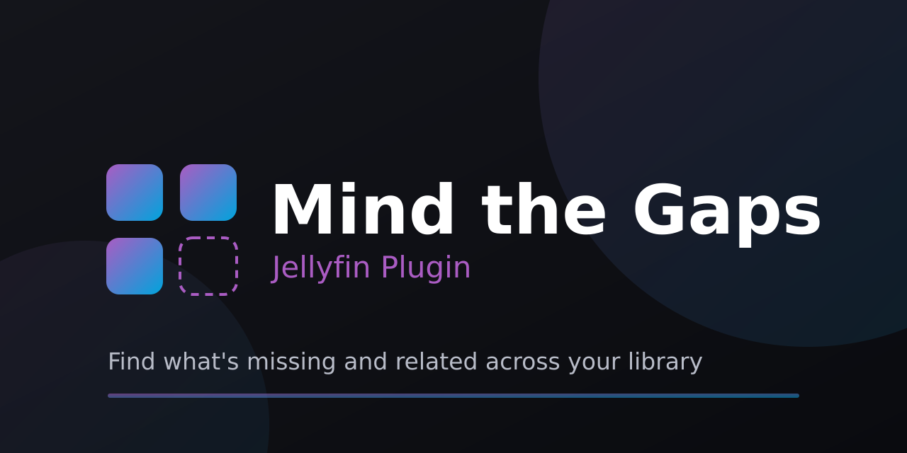
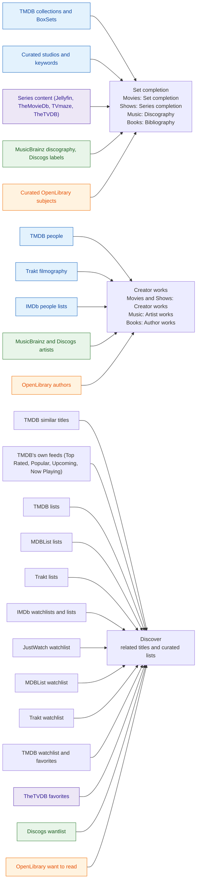

<p align="center">
  
</p>

<h1 align="center">Mind the Gaps</h1>

<p align="center">
Finds what's <b>missing</b> and what's <b>related</b> across your Jellyfin library and builds an easy
todo list for filling the gaps: movies absent from a collection, episodes absent from a series, films
your cast and crew made that you don't own, and related titles worth adding.
</p>

<p align="center">


</p>

## What it does

A scheduled task scans your library; a dashboard page (**Dashboard > Gaps Report**) shows the
results: tabbed by media domain, filterable and searchable within a tab, with links out (TMDB, IMDb, and
more) and an on-demand "Where to watch" for each item. What it scans for is on its own page
(**Dashboard > Mind the Gaps**), which is also where the plugin's Settings button lands.

<p align="center">
  <a href="docs/screenshots/report-movies-set-completion.png"></a>
</p>

More screenshots throughout the [report guide](docs/report-guide.md) and the
[configuration reference](docs/configuration.md).

The report's tabs are your **media domains** (Movies, Shows, Music, Books), each badged with its gap
count; a **View** dropdown inside the active tab picks which of three kinds of gap you are looking at:

| View               | What it finds                                              | Examples                                                                                                             |
| ------------------ | ---------------------------------------------------------- | -------------------------------------------------------------------------------------------------------------------- |
| **Set completion** | a missing piece of something you partly own                | a movie missing from a collection or franchise; a missing season or episode; a music artist's missing albums         |
| **Creator works**  | other work by a person or artist you own                   | a film or series an owned actor or director made; a music artist's wider catalog; an author's other books            |
| **Discover**       | related titles worth exploring and adding (off by default) | TMDB "similar" titles for what you own, TMDB's own feeds, and the unowned titles on a list you have added[^discover] |

[^discover]: The feeds are Top Rated, Popular, Upcoming and Now Playing. A list can be a TMDB, MDBList, Trakt or IMDb list, or your own JustWatch watchlist, and each list is shown as its own group.

Movies and shows work out of the box; music and books are on by default too. Discogs, Trakt, TheTVDB,
MDBList, and JustWatch are opt-in cross-checks and sources that need their own credentials. IMDb lists are
opt-in but need no credential.

How the pieces connect: the providers and lists you enable feed three gap patterns, and each pattern is
one of the View options inside whichever domain tab you are on.



## Features

- **Set completion**: missing movies in a collection/BoxSet, missing seasons and episodes in a series
  (cross-checked against TheMovieDb/TVmaze/TheTVDB), missing entries in a curated studio, keyword, record
  label, or book-subject set, and a collected music artist's missing discography.
- **Creator works**: an owned actor, director, or writer's filmography (TMDB, Trakt, or an IMDb people
  list), a music artist's wider catalog, and an author's other books.
- **Discover** (opt-in): TMDB "similar" titles for what you own, TMDB's own feeds, any TMDB/MDBList/
  Trakt/IMDb list or JustWatch watchlist you point it at, and your own want-lists across eight services.
- **Where to watch**: streaming availability per item, looked up on demand or in the background, never
  during the scan.
- **A usable report**: tabbed by domain, filterable and searchable, saved views and shareable links,
  Markdown export, and a per-row **Diagnose** popup that explains a false "missing" instead of just
  flagging it.
- **Clears itself out**: one click checks your library and drops what you now hold everywhere it appeared
  (its collection, its studio set, its director's filmography, any list that suggested it), then offers to
  re-check the source for whatever is still missing.
- **Send to your acquisition stack** (opt-in): hand a gap to Radarr, Sonarr, or Jellyseerr/Overseerr with a
  per-row **Send** action.
- **Web UI on Jellyfin's own pages** (experimental, opt-in): the same "missing from your library" rows on
  a person, movie, series, artist, or book page, plus a "Discover" row on the home screen and a per-user
  **want to watch** list.
- **Virtual placeholders** (opt-in): mint greyed-out "missing" placeholders in place, the way a missing
  episode renders inside a series. Fully reversible. See below.

Full detail on every source, setting, and screenshot of each: [report guide](docs/report-guide.md) and
[configuration reference](docs/configuration.md).

<p align="center">
  
</p>

## Installation

### From the plugin catalog (recommended)

1. In the dashboard: **Plugins > Repositories > +**.
2. Add the repository (any name) with this URL:

    ```
    https://raw.githubusercontent.com/IDisposable/jellyfin-plugin-mindthegaps/main/manifest.json
    ```

3. Open the **Catalog** tab, find **Mind the Gaps** under _General_, and click **Install**.
4. Restart Jellyfin.

New releases show up in the catalog automatically.

### Beta channel (optional)

To get pre-release builds before they reach the stable channel, add this repository URL instead of the one
above:

```
https://raw.githubusercontent.com/IDisposable/jellyfin-plugin-mindthegaps/main/manifest-beta.json
```

The beta channel carries every release (stable and pre-release); the stable channel carries only stable
releases. Both publish the same plugin, so Jellyfin always offers the highest version it sees and a stable
release supersedes the betas that led up to it. Use one channel or the other, not both.

### Manual

Download the `.zip` from the [latest release](https://github.com/IDisposable/jellyfin-plugin-mindthegaps/releases),
extract it into a folder under your server's `config/plugins/` directory (e.g.
`config/plugins/MindTheGaps/`), and restart Jellyfin.

Requires a server matching the plugin's `targetAbi` (currently `10.11` and `net9.0` or `12.0` and `net10.0`)

## Usage

Open **Dashboard > Mind the Gaps** and click **Rescan now**. For collection gaps, your BoxSets need a
TMDB id (from the TMDB box-set provider). The scan also runs on a schedule (editable under
**Dashboard > Scheduled Tasks**).

See the [report guide](docs/report-guide.md) for the domain tabs and the View dropdown (Set completion,
Creator works, Discover), the filters and saved views, and the per-row actions (where to watch, send,
mint, dismiss).

## Configuration

In the dashboard, go to **Plugins > Mind the Gaps**. Settings are grouped the way the data is: **What to
scan** holds the plain toggles (collections, series, filmographies, recommendations, music, books), and
**Sources** has one collapsible section per provider (TMDB, Trakt, MDBList, Discogs, OpenLibrary, TheTVDB,
IMDb, JustWatch), each holding that provider's toggles, ids, and credential together. A search box above
both narrows to whatever matches.

Nothing is required to get a useful report: the defaults scan collections, series, filmographies, music,
and books against the built-in TMDB key. Everything else, including the acquisition-stack handoff to
Radarr/Sonarr/Jellyseerr and every credential-gated source, is opt-in. For every setting, what it does, and
what changes when you set or clear it, see the [configuration reference](docs/configuration.md).

## Virtual placeholders (opt-in)

Off by default. The plugin can mint pathless "virtual" placeholder items so a gap renders greyed-out in
place, the way a missing episode does today - a stand-in for proper server support, fully reversible.
Mint a gap from its row, or several at once from the multi-select bar; **Remove minted items** in the
report's Maintenance section undoes everything. See the
[virtual items section of the configuration reference](docs/configuration.md#virtual-items) for the
mechanics.

## Works alongside your other plugins

Mind the Gaps is self-contained, so it does not depend on any other plugin and will not clash with them.
Its links are still extensible without any setup: it folds in whatever your server's own link providers
emit, so TMDB and IMDb links come from core, and a **JustWatch** link lights up automatically if the
separate [Jellyfin.Plugin.JustWatch](https://github.com/IDisposable/jellyfin-plugin-justwatch) is
installed. For the architecture behind this, see [CONTRIBUTING](CONTRIBUTING.md).

## Documentation

- **[Configuration reference](docs/configuration.md)** - every setting, what it does, and what changes
  when you set or clear it.
- **[Report guide](docs/report-guide.md)** - the three tabs, the filters and saved views, and the per-row
  actions.
- **[Roadmap and status](docs/roadmap.md)** - what is built, what is planned, and what is deliberately not.
- **[Advanced CSS customization](docs/custom-css.md)** - target a provider's links with your own
  stylesheet, plus a ready-to-paste icon snippet.
- **[Architecture decision records](docs/adr/)** - the reasoning behind the non-obvious design choices.

## Contributing

Bug reports, ideas, and pull requests are welcome. See **[CONTRIBUTING](CONTRIBUTING.md)** for how to
build, test, release, and find your way around the code.

Thanks tons to David @rappo for the inspiration to add the WebUI that injects the gaps directly into the Homepage, Movie, Series, and Artist pages.

## License

MIT. See [LICENSE](LICENSE).
