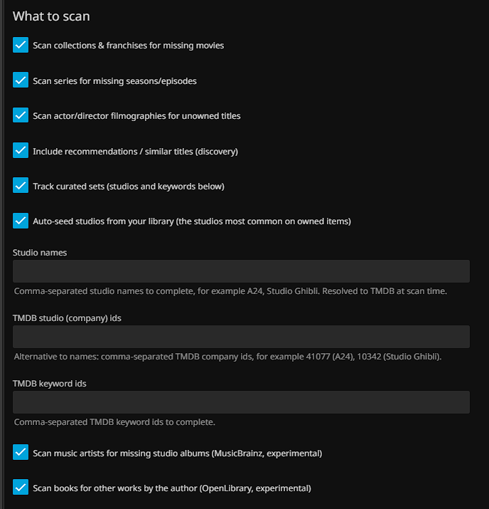
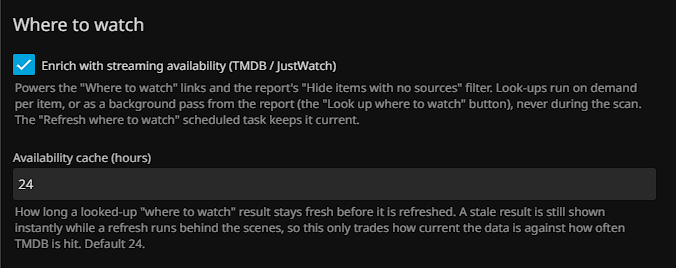
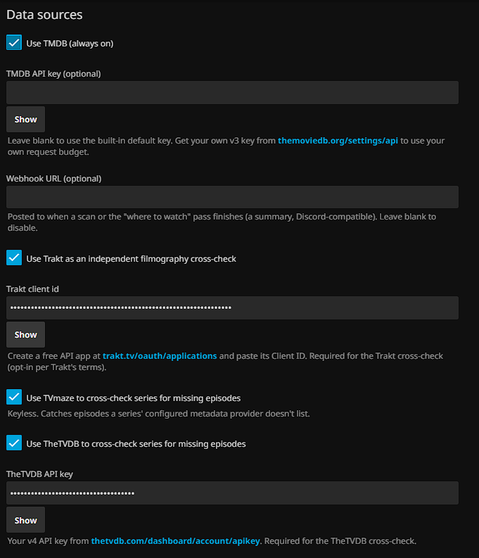
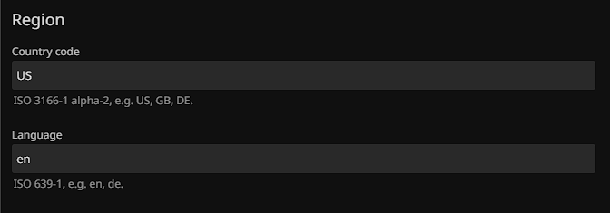
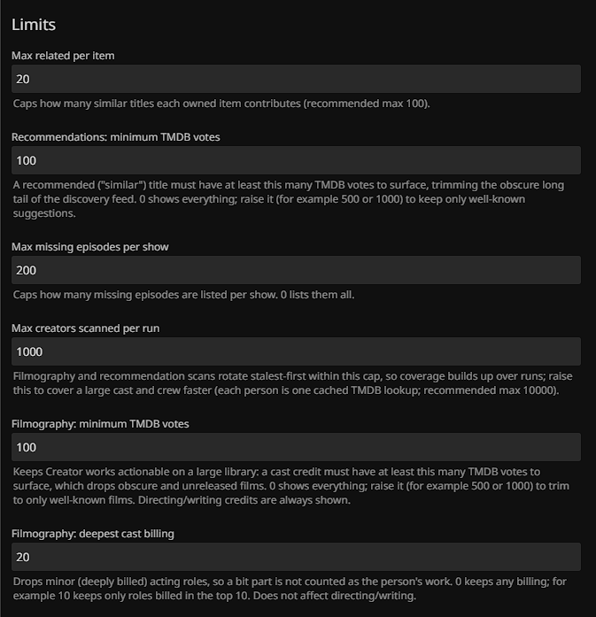
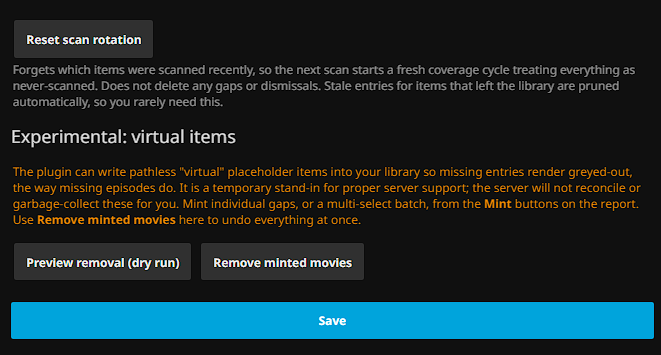

# Configuration reference

Every setting on the **Dashboard > Plugins > Mind the Gaps** page, what it does, and what happens when
you set or clear it. The page is grouped into the sections below in the same order. Nothing here is
required to get a useful report: the defaults scan collections, series, filmographies, music, and books
against the built-in TMDB key. Each setting is saved when you press **Save**; most take effect on the
next scan (press **Rescan now** on the report, or wait for the scheduled task).

For how to read the results, see the [report guide](report-guide.md).

The source toggles are split into two sections by what they do. **Complete what you own** fills in or
extends something already in your library; **Discover new titles** surfaces titles not tied to a
specific owned set. Turning one off removes its gaps from the next report; it does not delete anything
from your library. Leaving everything off produces an empty report.

## Complete what you own

| Setting | Default | When set | When cleared |
|---|---|---|---|
| **Collections / franchises** (`ScanCollections`) | On | For each owned movie that belongs to a TMDB collection (box set), lists the other films in that collection you do not own. Your BoxSets need a TMDB id for this to fire. | No collection-completion gaps. |
| **Series (missing seasons / episodes)** (`ScanSeries`) | On | Lists seasons and episodes a series should have but the library is missing, from the series' own metadata. Capped per show by **Max missing episodes per show**. | No missing-episode gaps from the library source (the TVmaze/TheTVDB cross-checks below are separate). |
| **People (filmographies)** (`ScanPeople`) | On | For each owned actor/director/writer, lists films and series from their TMDB filmography you do not own. Films land on Creator works in the Movies domain; series land on Creator works in the Shows domain. People are scanned stalest-first in batches capped by **Max creators scanned per run**, so coverage accumulates over repeated runs. | No filmography gaps. |
| **Track curated sets** (`ScanCuratedSets`) | Off | Treats the studios and keywords below as sets to complete: lists films from those TMDB companies/keywords you do not own. Gates only the studio and keyword inputs (the TMDB lists in the next section have their own toggle). | The curated studios, keywords, and auto-seed below are ignored. |
| **Auto-seed studios from your library** (`AutoSeedStudios`) | Off | Tracks the studios most common across your owned movies and series without you picking anything. Combine with the chips or use alone. Only matters when **Track curated sets** is on. | Only the studios/keywords you picked are tracked. |
| **Music (artist discographies)** (`ScanMusic`) | On | For each owned music artist, lists missing studio-album release-groups from the MusicBrainz discography. An artist you own an album by becomes a Set-completion "discography" (complete the collection); an artist you only own the odd track by becomes a Creator-works "artist works" (discover their wider catalog). | No music gaps. |
| **Books (author bibliographies)** (`ScanBooks`) | On | For each owned book, lists other entries in the author's bibliography (OpenLibrary). Known rough edges: author disambiguation, missing publish years, and duplicate titles (see the roadmap). | No book gaps. |
| **Curated books (OpenLibrary subjects)** (`ScanCuratedBooks`) | Off | Treats the OpenLibrary subjects below as Books sets to complete: lists the books tagged with each subject you do not own. | The OpenLibrary subjects are ignored. |
| **OpenLibrary subjects** (`CuratedOpenLibrarySubjects`) | Empty | Comma-separated OpenLibrary subject slugs (the part after `/subjects/` in an `openlibrary.org/subjects/<slug>` URL, lowercase with underscores, for example `science_fiction`). Only matters when **Curated books** is on. | No curated-book gaps. |

### Curated set inputs

The **Studios** and **Keywords** chip pickers only matter when **Track curated sets** is on; the
**Discogs labels** picker needs the Discogs token (under [Data sources](#data-sources)).

| Setting | When set | When cleared |
|---|---|---|
| **Studios** (`CuratedCompanyIds`) | Search TheMovieDb for a studio in the chip box and pick a match (for example A24 or Studio Ghibli); each becomes a removable chip. Only the matched TMDB company id is stored, so there is no resolution guesswork at scan time. | No studio sets. |
| **Keywords** (`CuratedKeywordIds`) | Search TheMovieDb for a keyword (a theme or motif) and pick a match; each becomes a chip. Only the keyword id is stored. | No keyword sets. |
| **Discogs labels** (`DiscogsLabelIds`) | Search Discogs for a record label and pick a match; each becomes a chip. The releases on that label you do not own become Set-completion gaps. Needs the **Discogs token** under Data sources. | No label sets. |

## Discover new titles

These sources surface titles not tied to a specific owned set. They land on the report's **Discover**
(Recommendations) tab. A title that is both on a curated list and recommended groups under the list,
with the recommendation kept as a secondary source, so each list reads as its own group.

| Setting | Default | When set | When cleared |
|---|---|---|---|
| **Recommendations (similar titles)** (`ScanRecommendations`) | Off | For each owned movie/series, surfaces TMDB "similar" titles you do not own. Can be noisy; this is discovery, not completion. Owned titles are used as seeds stalest-first, capped per run. | No recommendation gaps. |
| **Scan TMDB lists** (`ScanTmdbLists`) | Off | Surfaces the unowned movies from the TMDB lists named below. Separate from **Track curated sets**, so a discovery list can run without the studio and keyword sources. | The TMDB list ids are ignored. |
| **TMDB list ids** (`CuratedTmdbListIds`) | Empty | Comma-separated TMDB list ids; a list id is the number in its `themoviedb.org/list/<id>` URL. TMDB has no list search, so paste the id. Only matters when **Scan TMDB lists** is on. | No TMDB-list gaps. |
| **Scan MDBList community lists** (`ScanMdbList`) | Off | Surfaces the unowned titles (movies and shows) from the MDBList lists chosen below. Needs the **MDBList API key** under Data sources. | The MDBList lists are ignored. |
| **MDBList lists** (`MdbListListIds`) | Empty | Search MDBList for a public list and pick a match in the chip box; each becomes a removable chip. Only the chosen list id is stored. Only matters when **Scan MDBList community lists** is on. | No MDBList gaps. |
| **Scan Trakt lists** (`ScanTraktLists`) | Off | Surfaces the unowned titles (movies and shows) from the Trakt lists named below. Needs the **Trakt Client ID** under Data sources. | The Trakt lists are ignored. |
| **Trakt lists** (`CuratedTraktListIds`) | Empty | Comma-separated Trakt lists, each a numeric id or a slug (the part after `/lists/` in a `trakt.tv` list URL; Trakt accepts either). Only matters when **Scan Trakt lists** is on. | No Trakt-list gaps. |

## Where to watch

| Setting | Default | When set | When cleared |
|---|---|---|---|
| **Availability ("where to watch")** (`IncludeAvailability`) | On | Enables streaming-availability lookups: the per-row **Where to watch** button, the report's background **Look up where to watch** pass, the **Refresh where to watch** scheduled task, and the report's **Hide items with no sources** / per-provider filters. Lookups use TMDB `watch/providers` and never run during the scan itself. | The button and the availability filters do nothing; no provider data is fetched. |
| **Availability cache (hours)** (`AvailabilityCacheHours`) | 24 | How long a looked-up "where to watch" result stays fresh before it is refreshed. A stale result is still served instantly while a refresh runs in the background, so this only trades how current the data is against how often TMDB is hit, never responsiveness. Minimum 1. | (Used only when availability is on.) |

## Data sources

TMDB is always on (it powers collections, people, recommendations, and availability). The rest are
opt-in cross-checks that need your own credentials. The series-content cross-checks (TheMovieDb, TVmaze,
TheTVDB) are library-driven rather than toggled per provider: each runs when your Shows library lists it as
a metadata fetcher and the series carries its id, and when more than one applies they merge season by season
in your library's provider order. Only TheTVDB needs a credential (its key below); TheMovieDb and TVmaze are
keyless.

| Setting | Default | When set | When cleared |
|---|---|---|---|
| **TMDB API key** (`TmdbApiKey`) | Empty (built-in key) | Uses your own TMDB v3 key, so lookups draw on your request budget instead of the shared default. Get one at [themoviedb.org/settings/api](https://www.themoviedb.org/settings/api). | Falls back to the built-in public key. |
| **Webhook URL** (`WebhookUrl`) | Empty | Posts a summary (Discord-compatible `content` payload) when a scan or the availability pass finishes. | No webhook is sent. |
| **Trakt cross-check** (`TraktEnabled` + `TraktClientId`) | Off | Adds a Trakt filmography cross-check alongside TMDB, catching credits TMDB misses. Requires a free Trakt app **Client ID** from [trakt.tv/oauth/applications](https://trakt.tv/oauth/applications); opt-in per Trakt's terms. | No Trakt cross-check. |
| **TheTVDB API key** (`TvdbApiKey`) | Empty | Lets the series-content cross-check also consult TheTVDB (for a series your library fetches from TheTVDB). Requires your own v4 key from [thetvdb.com](https://thetvdb.com/dashboard/account/apikey). TheMovieDb and TVmaze are keyless and need nothing here. The cross-checks share episode ids so duplicates are de-duped, and run stalest-first over runs. | No TheTVDB cross-check (TheMovieDb and TVmaze still run for libraries that use them). |
| **Discogs source** (`ScanDiscogs` + `DiscogsToken`) | Off | Enables the Discogs label and artist source (the **Discogs labels** picker under Complete what you own, plus a discography pass for an owned artist that carries a Discogs id, covering artists MusicBrainz cannot resolve). Needs a Discogs personal access token (Discogs requires authentication to browse the catalog); create one on discogs.com under Settings, Developers. | No Discogs gaps. |
| **MDBList API key** (`MdbListApiKey`) | Empty | A free key from [mdblist.com](https://mdblist.com) (under Preferences); enables searching and reading MDBList community lists (the discovery source above). | The MDBList list search and source stay off. |

> Note: API keys are sensitive. The key fields are masked (password inputs) with a **Show** toggle to
> reveal one when you need to check it. If a key ever ends up in a URL or browser history, rotate it.

## Diagnostics

| Setting | Default | What it does | When off |
|---|---|---|---|
| **Detailed API logging** (`DetailedApiLogging`) | Off | Logs every external API request and response to the server log: the hand-rolled clients through the shared HTTP layer, the acquisition sends, the TMDB calls, and the webhook. Turn it on to debug a source or an acquisition target that is not behaving, then turn it back off. Api keys and tokens ride in headers and are never logged. | No request or response logging; failures are still logged. |

## Acquisition stack (optional)

Hand a gap off to your downloaders. Each report row gets a **Send** action, but a button appears only for
a target you have filled in here. Radarr takes a movie, Sonarr takes the owning series (it grabs that
series' missing episodes), and Jellyseerr/Overseerr requests either. Keys stay on the server, so the
report's **Send** action posts to the plugin and the plugin calls your downloader. All fields are empty
by default, which leaves the matching Send button off.

| Setting | When set |
|---|---|
| **Jellyseerr/Overseerr URL** (`SeerrUrl`) + **API key** (`SeerrApiKey`) | Enables the per-row **Request** action; the title is requested in Jellyseerr/Overseerr (for example `http://localhost:5055`). |
| **Radarr URL** (`RadarrUrl`) + **API key** (`RadarrApiKey`) | Enables the per-row **Radarr** action on a missing movie (for example `http://localhost:7878`). |
| **Radarr quality profile id** (`RadarrQualityProfileId`) | The numeric quality profile a sent movie is added with (Settings, Profiles in Radarr). Must be greater than zero for the Radarr handoff. |
| **Radarr root folder** (`RadarrRootFolderPath`) | The root folder a sent movie is added under (for example `/movies`). Required for the Radarr handoff. |
| **Sonarr URL** (`SonarrUrl`) + **API key** (`SonarrApiKey`) | Enables the per-row **Sonarr** action on a missing series or episode; the owning series is sent (for example `http://localhost:8989`). |
| **Sonarr quality profile id** (`SonarrQualityProfileId`) | The numeric quality profile a sent series is added with. Must be greater than zero for the Sonarr handoff. |
| **Sonarr root folder** (`SonarrRootFolderPath`) | The root folder a sent series is added under (for example `/tv`). Required for the Sonarr handoff. |
| **Sonarr monitor** (`SonarrMonitor`) | Which episodes Sonarr monitors on add: `all`, `future`, `missing`, `existing`, `firstSeason`, `latestSeason`, `pilot`, or `none`. Defaults to `all`. |

## Region

| Setting | Default | Effect |
|---|---|---|
| **Country code** (`MetadataCountryCode`) | `US` | ISO 3166-1 alpha-2 (e.g. `US`, `GB`, `DE`). Drives release dates and which country's streaming providers "where to watch" reports. |
| **Language** (`MetadataLanguage`) | `en` | ISO 639-1 (e.g. `en`, `de`). Language of titles and overviews fetched from TMDB. |

## Limits

These bound how much each scan produces, so one prolific show or a huge cast does not flood the list.

| Setting | Default | Effect |
|---|---|---|
| **Max related per item** (`MaxRelatedPerItem`) | 20 | Caps how many "similar" titles each owned item contributes to recommendations. |
| **Recommendations: minimum TMDB votes** (`MinRecommendationVotes`) | 100 | A recommended ("similar") title must have at least this many TMDB votes to surface, trimming the obscure long tail of the discovery feed. `0` shows everything; raise it (e.g. 500 or 1000) to keep only well-known suggestions. |
| **Max missing episodes per show** (`MaxMissingEpisodesPerShow`) | 200 | Caps missing episodes listed per show. `0` lists them all. |
| **Max creators scanned per run** (`MaxFilmographyPeople`) | 1000 | Caps how many owned people have their filmography scanned per run. People are scanned stalest-first (never-scanned first, then longest-ago), so a lower cap still eventually covers everyone over successive runs; raise it to cover a large cast/crew faster (each person is one cached TMDB lookup). |
| **Filmography: minimum TMDB votes** (`MinFilmographyVotes`) | 100 | A cast credit must have at least this many TMDB votes to surface as a Creator works gap, which keeps the list actionable on a large library by dropping obscure and unreleased films. `0` shows everything; raise it (e.g. 500 or 1000) to trim to only well-known films. Directing/writing credits are always shown (TMDB's filmography crew carries no vote count). |
| **Filmography: deepest cast billing** (`MaxCastBillingOrder`) | 0 (any) | Drops minor (deeply billed) acting roles so a bit part is not counted as the person's work. `0` keeps any billing; e.g. `10` keeps only roles billed in the top 10. Does not affect directing/writing. |

**Reset scan rotation** (button). Forgets which items were scanned recently so the next scan starts a
fresh coverage cycle, treating everything as never-scanned. It does not delete any gaps or dismissals.
You rarely need it: each scan automatically prunes rotation entries for items that have left the
library, so the table stays the size of the library on its own. Use it after raising a cap, or if you
suspect the rotation is stuck.

## Virtual items

Off by default and clearly marked. Lets the plugin mint pathless "virtual" placeholder items so a gap
renders greyed-out in place, and reconcile/remove them. This is a stand-in for proper server support;
everything minted is tagged and fully reversible. See the
[virtual placeholders section of the README](../README.md#virtual-placeholders-opt-in)
and [ADR-0004](adr/) for the rationale, and the [report guide](report-guide.md) for the per-row Mint
controls. The settings page itself keeps only **Remove minted movies** (with a dry-run preview) to undo
everything at once.

## How settings reach a report

Configuration changes apply to the **next** scan, not the report already on screen. The persisted
report carries the plugin version it was generated with, so after a plugin upgrade the dashboard nudges
you to rescan (the gap ids and links are a stable contract; see [ADR-0008](adr/)). Press **Rescan now**
on the report to apply changes immediately, or let the scheduled task pick them up.
