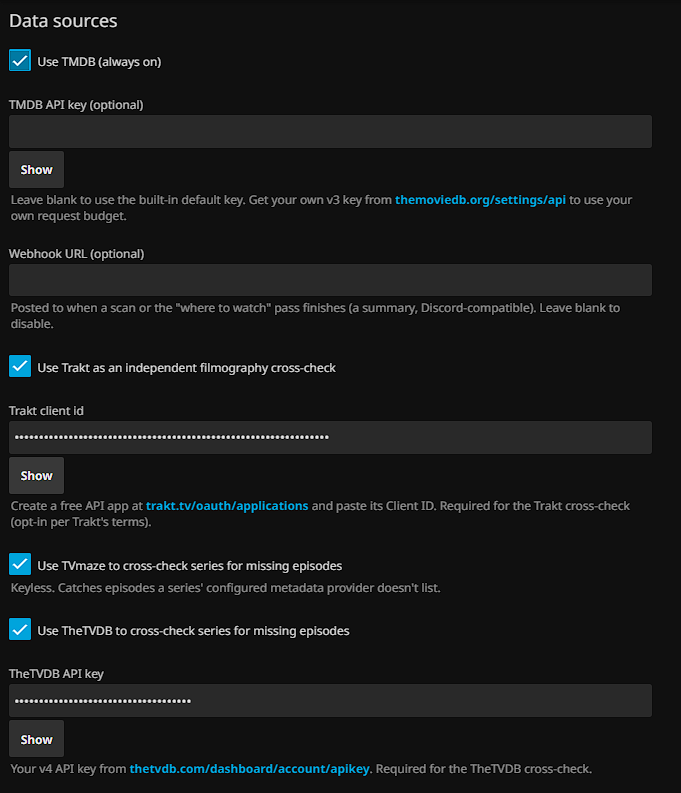

# Configuration reference

Every setting on the **Dashboard > Plugins > Mind the Gaps** page, what it does, and what happens when
you set or clear it. The page is grouped into the sections below in the same order. Nothing here is
required to get a useful report: the defaults scan collections, series, filmographies, music, and books
against the built-in TMDB key. Each setting is saved when you press **Save**; most take effect on the
next scan (press **Rescan now** on the report, or wait for the scheduled task).

For how to read the results, see the [report guide](report-guide.md).

A search box above the form narrows **What to scan** and **Sources** to whatever matches, and opens
whichever provider section a match lands in. Turning a source off removes its gaps from the next report;
it does not delete anything from your library. Leaving everything off produces an empty report.

## What to scan

The plain toggles: no id, username, or key of their own. Every source with its own account, list, or
credential is under [Sources](#sources) below.

| Setting                                                      | Default | When set                                                                                                                                                                                                                                                                                                                                         | When cleared                                                                                                              |
| ------------------------------------------------------------ | ------- | ------------------------------------------------------------------------------------------------------------------------------------------------------------------------------------------------------------------------------------------------------------------------------------------------------------------------------------------------ | ------------------------------------------------------------------------------------------------------------------------- |
| **Collections / franchises** (`ScanCollections`)             | On      | For each owned movie that belongs to a TMDB collection (box set), lists the other films in that collection you do not own. Your BoxSets need a TMDB id for this to fire.                                                                                                                                                                         | No collection-completion gaps.                                                                                            |
| **Series (missing seasons / episodes)** (`ScanSeries`)       | On      | Lists seasons and episodes a series should have but the library is missing, from the series' own metadata. Capped per show by **Max missing episodes per show**.                                                                                                                                                                                 | No missing-episode gaps from the library source (the TVmaze/TheTVDB cross-checks under [TheTVDB](#thetvdb) are separate). |
| **People (filmographies)** (`ScanPeople`)                    | On      | For each owned actor/director/writer, lists films and series from their TMDB filmography you do not own. Films land on Creator works in the Movies domain; series land on Creator works in the Shows domain. People are scanned stalest-first in batches capped by **Max creators scanned per run**, so coverage accumulates over repeated runs. | No filmography gaps.                                                                                                      |
| **Recommendations (similar titles)** (`ScanRecommendations`) | Off     | For each owned movie/series, surfaces TMDB "similar" titles you do not own on the Discover view. Can be noisy; this is discovery, not completion. Owned titles are used as seeds stalest-first, capped per run.                                                                                                                                  | No recommendation gaps.                                                                                                   |
| **Music (artist discographies)** (`ScanMusic`)               | On      | For each owned music artist, lists missing studio-album release-groups from the MusicBrainz discography. An artist you own an album by becomes a Set-completion "discography" (complete the collection); an artist you only own the odd track by becomes a Creator-works "artist works" (discover their wider catalog).                          | No music gaps.                                                                                                            |
| **Books (author bibliographies)** (`ScanBooks`)              | On      | For each owned book, lists other entries in the author's bibliography (OpenLibrary). Known rough edges: author disambiguation, missing publish years, and duplicate titles (see the roadmap).                                                                                                                                                    | No book gaps.                                                                                                             |

## Sources

Every integration with its own account, list, or credential, one collapsible section per provider: its
toggles, ids, and key all live together instead of being split by what they do. Collapsed by default; a
provider you already use opens on its own and its header badges whether it is on.

### TMDB

TMDB is always on for the core sources (it powers collections, people, recommendations, and
availability); everything below is opt-in.

| Setting                                                                                                   | Default              | When set                                                                                                                                                                                                                                                                                                                                                                                                                                                                                                                                                      | When cleared                                                                               |
| --------------------------------------------------------------------------------------------------------- | -------------------- | ------------------------------------------------------------------------------------------------------------------------------------------------------------------------------------------------------------------------------------------------------------------------------------------------------------------------------------------------------------------------------------------------------------------------------------------------------------------------------------------------------------------------------------------------------------- | ------------------------------------------------------------------------------------------ |
| **Track curated sets** (`ScanCuratedSets`)                                                                | Off                  | Treats the studios and keywords below as sets to complete: lists films from those TMDB companies/keywords you do not own.                                                                                                                                                                                                                                                                                                                                                                                                                                     | The curated studios, keywords, and auto-seed below are ignored.                            |
| **Auto-seed studios from your library** (`AutoSeedStudios`)                                               | Off                  | Tracks the studios most common across your owned movies and series without you picking anything. Combine with the chips or use alone. Only matters when **Track curated sets** is on.                                                                                                                                                                                                                                                                                                                                                                         | Only the studios/keywords you picked are tracked.                                          |
| **Studios** (`CuratedCompanyIds`)                                                                         | Empty                | Search TheMovieDb for a studio in the chip box and pick a match (for example A24 or Studio Ghibli); each becomes a removable chip. Only the matched TMDB company id is stored. Only matters when **Track curated sets** is on.                                                                                                                                                                                                                                                                                                                                | No studio sets.                                                                            |
| **Keywords** (`CuratedKeywordIds`)                                                                        | Empty                | Search TheMovieDb for a keyword (a theme or motif) and pick a match; each becomes a chip. Only the keyword id is stored. Only matters when **Track curated sets** is on.                                                                                                                                                                                                                                                                                                                                                                                      | No keyword sets.                                                                           |
| **Discover unowned movies from TMDB lists** (`ScanTmdbLists`)                                             | Off                  | Surfaces the unowned movies from the TMDB lists named below. Separate from **Track curated sets**, so a discovery list can run without the studio and keyword sources.                                                                                                                                                                                                                                                                                                                                                                                        | The TMDB list ids are ignored.                                                             |
| **TMDB list ids** (`CuratedTmdbListIds`)                                                                  | Empty                | Comma-separated TMDB list ids; a list id is the number in its `themoviedb.org/list/<id>` URL. TMDB has no list search, so paste the id. Only matters when **Discover unowned movies from TMDB lists** is on.                                                                                                                                                                                                                                                                                                                                                  | No TMDB-list gaps.                                                                         |
| **TMDB discover feeds** (`ScanTmdbTopRated`, `ScanTmdbPopular`, `ScanTmdbUpcoming`, `ScanTmdbNowPlaying`) | Off                  | Four independent toggles for TMDB's own Top Rated, Popular, Upcoming, and Now Playing feeds; each surfaces its unowned movies on Discover. No account needed, just the TMDB API key below (the built-in default works).                                                                                                                                                                                                                                                                                                                                       | Whichever feed you clear stops surfacing.                                                  |
| **Scan TMDB watchlist** (`ScanTmdbWatchlist`)                                                             | Off                  | Surfaces the unowned movies and shows on the connected TheMovieDb account's watchlist. Needs **your own TMDB API key** and a connected account (below). No vote floor applies: you put these there deliberately.                                                                                                                                                                                                                                                                                                                                              | The watchlist is ignored.                                                                  |
| **Also read TMDB favorites** (`ScanTmdbFavorites`)                                                        | Off                  | Reads the account's favorites as well as its watchlist. Off by default, since a favorite is usually something already owned.                                                                                                                                                                                                                                                                                                                                                                                                                                  | Only the watchlist is read.                                                                |
| **TMDB API key** (`TmdbApiKey`)                                                                           | Empty (built-in key) | Uses your own TMDB v3 key, so lookups draw on your request budget instead of the shared default. Get one at [themoviedb.org/settings/api](https://www.themoviedb.org/settings/api). Also **required** to connect a TMDB account, because a TMDB session belongs to the application whose key created it, and the built-in fallback is Jellyfin's own key (a copy of the one in the server's `TmdbUtils.cs`, registered to the Jellyfin project and shared by every install). Catalog reads through it are what it is published for; account sessions are not. | Falls back to the built-in public key, and the TMDB account connect button stays disabled. |
| **TMDB account** (`TmdbSessionId`)                                                                        | Empty                | Connected with the two-step button: step one opens themoviedb.org to approve, step two finishes in the dashboard. The approval URL carries no redirect, so **nothing calls back into your server and it does not need to be reachable from the internet**. TMDB session ids do not expire, so this is a one-time setup. The session can modify your TMDB account, so it is stored as a secret and never displayed. Disconnecting forgets it here; to revoke it at TMDB, remove the application under your themoviedb.org account settings.                    | No TMDB account gaps.                                                                      |

### Trakt

| Setting                                         | Default | When set                                                                                                                                                                                                                                                                                                                                          | When cleared                                                          |
| ----------------------------------------------- | ------- | ------------------------------------------------------------------------------------------------------------------------------------------------------------------------------------------------------------------------------------------------------------------------------------------------------------------------------------------------- | --------------------------------------------------------------------- |
| **Trakt cross-check** (`TraktEnabled`)          | Off     | Adds a Trakt filmography cross-check alongside TMDB, catching credits TMDB misses. Needs the **Trakt client id** below.                                                                                                                                                                                                                           | No Trakt cross-check.                                                 |
| **Scan Trakt lists** (`ScanTraktLists`)         | Off     | Surfaces the unowned titles (movies and shows) from the Trakt lists named below. Needs the **Trakt client id** below.                                                                                                                                                                                                                             | The Trakt lists are ignored.                                          |
| **Trakt lists** (`CuratedTraktListIds`)         | Empty   | Comma-separated Trakt lists, each a numeric id or a slug (the part after `/lists/` in a `trakt.tv` list URL; Trakt accepts either). Only matters when **Scan Trakt lists** is on.                                                                                                                                                                 | No Trakt-list gaps.                                                   |
| **Scan Trakt watchlist** (`ScanTraktWatchlist`) | Off     | Surfaces the unowned movies and shows on a Trakt user's watchlist. Needs the **Trakt client id** below and the username below; Trakt serves a public profile's watchlist without OAuth.                                                                                                                                                           | The watchlist is ignored.                                             |
| **Trakt username** (`TraktUsername`)            | Empty   | Whose watchlist to read, as the username or profile slug. The profile has to be public. Trakt answers a private profile, an unknown username, and an empty watchlist identically (200 with an empty array, and it does not send the documented `X-Private-User` header), so a wrong value reads as "nothing on the list" rather than as an error. | No Trakt watchlist gaps.                                              |
| **Trakt client id** (`TraktClientId`)           | Empty   | Create a free API app at [trakt.tv/oauth/applications](https://trakt.tv/oauth/applications) and paste its Client ID. Required for the cross-check and every Trakt list/watchlist above (opt-in per Trakt's terms).                                                                                                                                | No Trakt cross-check, and every Trakt list/watchlist above stays off. |

### MDBList

| Setting                                             | Default | When set                                                                                                                                                                                       | When cleared                                             |
| --------------------------------------------------- | ------- | ---------------------------------------------------------------------------------------------------------------------------------------------------------------------------------------------- | -------------------------------------------------------- |
| **Scan MDBList community lists** (`ScanMdbList`)    | Off     | Surfaces the unowned titles (movies and shows) from the MDBList lists chosen below. Needs the **MDBList API key** below.                                                                       | The MDBList lists are ignored.                           |
| **MDBList lists** (`MdbListListIds`)                | Empty   | Search MDBList for a public list and pick a match in the chip box; each becomes a removable chip. Only the chosen list id is stored. Only matters when **Scan MDBList community lists** is on. | No MDBList gaps.                                         |
| **Scan MDBList watchlist** (`ScanMdbListWatchlist`) | Off     | Surfaces the unowned movies and shows on the MDBList account's **own** watchlist, not a community list. The **MDBList API key** identifies the account, so there is no username to enter.      | The watchlist is ignored.                                |
| **MDBList API key** (`MdbListApiKey`)               | Empty   | A free key from [mdblist.com](https://mdblist.com) (under Preferences); enables searching and reading MDBList lists, and identifies your account for the watchlist above.                      | The MDBList list search, source, and watchlist stay off. |

### Discogs

| Setting                                                                            | Default | When set                                                                                                                                                                                                                     | When cleared                                                                                 |
| ---------------------------------------------------------------------------------- | ------- | ---------------------------------------------------------------------------------------------------------------------------------------------------------------------------------------------------------------------------- | -------------------------------------------------------------------------------------------- |
| **Use Discogs to complete record labels and artist discographies** (`ScanDiscogs`) | Off     | Enables the Discogs label source (the **Discogs labels** picker below) and a discography pass for an owned artist that carries a Discogs id, covering artists MusicBrainz cannot resolve. Needs the **Discogs token** below. | No Discogs gaps.                                                                             |
| **Discogs labels** (`DiscogsLabelIds`)                                             | Empty   | Search Discogs for a record label and pick a match; each becomes a chip. The releases on that label you do not own become Set-completion gaps.                                                                               | No label sets.                                                                               |
| **Scan Discogs wantlist** (`ScanDiscogsWantlist`)                                  | Off     | Surfaces the unowned releases on a Discogs wantlist as Music gaps. Needs the **Discogs token** below and the username below.                                                                                                 | The wantlist is ignored.                                                                     |
| **Discogs username** (`DiscogsUsername`)                                           | Empty   | Whose wantlist to read. Discogs addresses a wantlist by username, so the token says who is asking and this says whose list; your own always works, someone else's only if they have made it public.                          | No Discogs wantlist gaps.                                                                    |
| **Discogs token** (`DiscogsToken`)                                                 | Empty   | A Discogs personal access token (Discogs requires authentication to browse the catalog). Create one on discogs.com under Settings, Developers.                                                                               | No Discogs gaps at all: the label source, wantlist, and artist-discography pass all need it. |

### OpenLibrary

Keyless: every OpenLibrary source below needs only a public list or subject, no credential.

| Setting                                                           | Default | When set                                                                                                                                                                                                                                              | When cleared                          |
| ----------------------------------------------------------------- | ------- | ----------------------------------------------------------------------------------------------------------------------------------------------------------------------------------------------------------------------------------------------------- | ------------------------------------- |
| **Complete books from OpenLibrary subjects** (`ScanCuratedBooks`) | Off     | Treats the OpenLibrary subjects below as Books sets to complete: lists the books tagged with each subject you do not own.                                                                                                                             | The OpenLibrary subjects are ignored. |
| **OpenLibrary subjects** (`CuratedOpenLibrarySubjects`)           | Empty   | Comma-separated OpenLibrary subject slugs (the part after `/subjects/` in an `openlibrary.org/subjects/<slug>` URL, lowercase with underscores, for example `science_fiction`). Only matters when **Complete books from OpenLibrary subjects** is on. | No curated-book gaps.                 |
| **Scan OpenLibrary want to read** (`ScanOpenLibraryWantToRead`)   | Off     | Surfaces the unowned works on an OpenLibrary "Want to Read" shelf as Books gaps.                                                                                                                                                                      | The shelf is ignored.                 |
| **OpenLibrary username** (`OpenLibraryUsername`)                  | Empty   | The part after `/people/` in an `openlibrary.org` profile address. The reading log has to be public, or OpenLibrary serves nothing.                                                                                                                   | No want-to-read gaps.                 |

### TheTVDB

| Setting                                          | Default | When set                                                                                                                                                                                                                                                                                                                                                                  | When cleared                                                                          |
| ------------------------------------------------ | ------- | ------------------------------------------------------------------------------------------------------------------------------------------------------------------------------------------------------------------------------------------------------------------------------------------------------------------------------------------------------------------------- | ------------------------------------------------------------------------------------- |
| **TheTVDB API key** (`TvdbApiKey`)               | Empty   | Lets the series-content cross-check also consult TheTVDB (for a series your library fetches from TheTVDB). Requires your own v4 key from [thetvdb.com](https://thetvdb.com/dashboard/account/apikey). TheMovieDb and TVmaze are keyless and run without any setting here; the cross-checks share episode ids so duplicates are de-duped, and run stalest-first over runs. | No TheTVDB cross-check (TheMovieDb and TVmaze still run for libraries that use them). |
| **TheTVDB subscriber PIN** (`TvdbPin`)           | Empty   | Optional for the episode cross-check, which only reads the catalog. Required to read your **account**, which today means your favorites: a key-only token is not tied to an account, so TheTVDB refuses `/user/favorites` without it. When set it is sent on every login, and the resulting token serves the catalog reads too, so there is one login path either way.    | Account reads are refused; the episode cross-check is unaffected.                     |
| **Scan TheTVDB favorites** (`ScanTvdbFavorites`) | Off     | Surfaces the unowned series favorited on TheTVDB. Needs the **TheTVDB API key** and **subscriber PIN** above. Expect few results: a favorite is usually a show you already hold.                                                                                                                                                                                          | The favorites are ignored.                                                            |

### IMDb

Keyless: IMDb's own API serves any list its owner has published, no credential needed.

| Setting                                              | Default | When set                                                                                                                                                                                                                                                                                                                                                                                                                                                                                                                                                                                               | When cleared                                                        |
| ---------------------------------------------------- | ------- | ------------------------------------------------------------------------------------------------------------------------------------------------------------------------------------------------------------------------------------------------------------------------------------------------------------------------------------------------------------------------------------------------------------------------------------------------------------------------------------------------------------------------------------------------------------------------------------------------------ | ------------------------------------------------------------------- |
| **Scan IMDb lists** (`ScanImdbLists`)                | Off     | Surfaces the unowned titles (movies and shows) from the IMDb watchlists and lists named below.                                                                                                                                                                                                                                                                                                                                                                                                                                                                                                         | The IMDb ids are ignored.                                           |
| **IMDb watchlists and lists** (`ImdbListIds`)        | Empty   | Comma-separated IMDb ids, each a user id (`ur1000000`, meaning that user's watchlist) or a list id (`ls055576446`); a full `imdb.com` address holding either can be pasted instead. The watchlist or list has to be public (IMDb, Your Account, Privacy), or IMDb answers "permission denied" and the scan logs and skips it. The newer profile addresses that read `imdb.com/user/p.<random>/` carry no usable id, because IMDb's API accepts only the `ur` form: open the watchlist from Your Lists and take the `ls` id out of its address. Only matters when **Scan IMDb lists** is on.            | No IMDb-list gaps.                                                  |
| **Follow IMDb people lists** (`ScanImdbPeopleLists`) | Off     | An IMDb list holds either titles or people, and IMDb says which. A **people** list in the field above is read as a filmography seed instead of a discovery list: every unowned film and series each named person made becomes a **Creator works** gap. This is the only creator source not seeded from your library, so it is what tracks a director you own nothing by. One people list is many filmographies, so at most 50 people per list are followed per scan; the Creator works relevance floors (minimum votes, cast billing) still apply, and a creator you mute from the report stays muted. | People lists in the field are skipped; titles lists are unaffected. |

### JustWatch

| Setting                                              | Default | When set                                                                                                                                                                                                                                                                                                                                                                                                  | When cleared                        |
| ---------------------------------------------------- | ------- | --------------------------------------------------------------------------------------------------------------------------------------------------------------------------------------------------------------------------------------------------------------------------------------------------------------------------------------------------------------------------------------------------------- | ----------------------------------- |
| **Scan JustWatch watchlist** (`ScanJustWatchLists`)  | Off     | Surfaces the unowned titles (movies and shows) on the signed-in JustWatch account's watchlist. Needs the **JustWatch token** below.                                                                                                                                                                                                                                                                       | The JustWatch watchlist is ignored. |
| **Also read JustWatch likes** (`ScanJustWatchLikes`) | Off     | Reads the account's liked titles as well as its watchlist. Off by default, since a like is a weaker signal than a deliberate watchlist entry.                                                                                                                                                                                                                                                             | Only the watchlist is read.         |
| **JustWatch token** (`JustWatchToken`)               | Empty   | JustWatch issues no api keys and its published API covers streaming availability only, so a personal list needs your own session token. Sign in at `justwatch.com`, open the browser developer tools, Network tab, reload My Lists, pick any request to `apis.justwatch.com`, and copy the `Authorization` header value after `Bearer `. It expires; the scan logs a warning and carries on when it does. | The JustWatch source stays off.     |

> Note: API keys are sensitive. The key fields are masked (password inputs) with a **Show** toggle to
> reveal one when you need to check it. If a key ever ends up in a URL or browser history, rotate it.

## Where to watch

| Setting                                                     | Default | When set                                                                                                                                                                                                                                                                                                                                | When cleared                                                                     |
| ----------------------------------------------------------- | ------- | --------------------------------------------------------------------------------------------------------------------------------------------------------------------------------------------------------------------------------------------------------------------------------------------------------------------------------------- | -------------------------------------------------------------------------------- |
| **Availability ("where to watch")** (`IncludeAvailability`) | On      | Enables streaming-availability lookups: the per-row **Where to watch** button, the report's background **Look up where to watch** pass, the **Refresh where to watch** scheduled task, and the report's **Hide items with no sources** / per-provider filters. Lookups use TMDB `watch/providers` and never run during the scan itself. | The button and the availability filters do nothing; no provider data is fetched. |
| **Availability cache (hours)** (`AvailabilityCacheHours`)   | 24      | How long a looked-up "where to watch" result stays fresh before it is refreshed. A stale result is still served instantly while a refresh runs in the background, so this only trades how current the data is against how often TMDB is hit, never responsiveness. Minimum 1.                                                           | (Used only when availability is on.)                                             |

## Diagnostics

| Setting                                         | Default | What it does                                                                                                                                                                                                                                                                                                                                | When off                                                   |
| ----------------------------------------------- | ------- | ------------------------------------------------------------------------------------------------------------------------------------------------------------------------------------------------------------------------------------------------------------------------------------------------------------------------------------------- | ---------------------------------------------------------- |
| **Detailed API logging** (`DetailedApiLogging`) | Off     | Logs every external API request and response to the server log: the hand-rolled clients through the shared HTTP layer, the acquisition sends, the TMDB calls, and the webhook. Turn it on to debug a source or an acquisition target that is not behaving, then turn it back off. Api keys and tokens ride in headers and are never logged. | No request or response logging; failures are still logged. |

## Acquisition stack (optional)

Hand a gap off to your downloaders. Each report row gets a **Send** action, but a button appears only for
a target you have filled in here, one collapsible section per target. Radarr takes a movie, Sonarr takes
the owning series (it grabs that series' missing episodes), and Jellyseerr/Overseerr requests either. Keys
stay on the server, so the report's **Send** action posts to the plugin and the plugin calls your
downloader. All fields are empty by default, which leaves the matching Send button off.

| Setting                                                                 | When set                                                                                                                                                                                                                                                                                       |
| ----------------------------------------------------------------------- | ---------------------------------------------------------------------------------------------------------------------------------------------------------------------------------------------------------------------------------------------------------------------------------------------- |
| **Jellyseerr/Overseerr URL** (`SeerrUrl`) + **API key** (`SeerrApiKey`) | Enables the per-row **Request** action; the title is requested in Jellyseerr/Overseerr (for example `http://localhost:5055`).                                                                                                                                                                  |
| **Radarr URL** (`RadarrUrl`) + **API key** (`RadarrApiKey`)             | Enables the per-row **Radarr** action on a missing movie (for example `http://localhost:7878`).                                                                                                                                                                                                |
| **Radarr quality profile id** (`RadarrQualityProfileId`)                | The numeric quality profile a sent movie is added with (Settings, Profiles in Radarr). Must be greater than zero for the Radarr handoff.                                                                                                                                                       |
| **Radarr root folder** (`RadarrRootFolderPath`)                         | The root folder a sent movie is added under (for example `/movies`). Required for the Radarr handoff.                                                                                                                                                                                          |
| **Sonarr URL** (`SonarrUrl`) + **API key** (`SonarrApiKey`)             | Enables the per-row **Sonarr** action on a missing series or episode; the owning series is sent (for example `http://localhost:8989`). A gap sent this way carries the series' own title, not the name of whatever surfaced it (a filmography credit, a recommendation, or a favorites entry). |
| **Sonarr quality profile id** (`SonarrQualityProfileId`)                | The numeric quality profile a sent series is added with. Must be greater than zero for the Sonarr handoff.                                                                                                                                                                                     |
| **Sonarr root folder** (`SonarrRootFolderPath`)                         | The root folder a sent series is added under (for example `/tv`). Required for the Sonarr handoff.                                                                                                                                                                                             |
| **Sonarr monitor** (`SonarrMonitor`)                                    | Which episodes Sonarr monitors on add: `all`, `future`, `missing`, `existing`, `firstSeason`, `latestSeason`, `pilot`, or `none`. Defaults to `all`.                                                                                                                                           |

A rejected Radarr, Sonarr, or Jellyseerr request shows that service's own validation message (for example
"This movie has already been added") instead of a raw response body, where the service provides one.

## Links

| Setting                                           | Default                               | Effect                                                                                                                        |
| ------------------------------------------------- | ------------------------------------- | ----------------------------------------------------------------------------------------------------------------------------- |
| **Web search URL template** (`SearchUrlTemplate`) | `https://www.google.com/search?q={0}` | The "Web search" link on a TODO row uses this, with `{0}` replaced by the item's title, year, and creator.                    |
| **Webhook URL** (`WebhookUrl`)                    | Empty                                 | Posts a summary (Discord-compatible `content` payload) when a scan or the availability pass finishes. Leave blank to disable. |

## Region

| Setting                                  | Default | Effect                                                                                                                             |
| ---------------------------------------- | ------- | ---------------------------------------------------------------------------------------------------------------------------------- |
| **Country code** (`MetadataCountryCode`) | `US`    | ISO 3166-1 alpha-2 (e.g. `US`, `GB`, `DE`). Drives release dates and which country's streaming providers "where to watch" reports. |
| **Language** (`MetadataLanguage`)        | `en`    | ISO 639-1 (e.g. `en`, `de`). Language of titles and overviews fetched from TMDB.                                                   |

## Limits

These bound how much each scan produces, so one prolific show or a huge cast does not flood the list.

| Setting                                                                | Default | Effect                                                                                                                                                                                                                                                                                                                                                                |
| ---------------------------------------------------------------------- | ------- | --------------------------------------------------------------------------------------------------------------------------------------------------------------------------------------------------------------------------------------------------------------------------------------------------------------------------------------------------------------------- |
| **Max related per item** (`MaxRelatedPerItem`)                         | 20      | Caps how many "similar" titles each owned item contributes to recommendations.                                                                                                                                                                                                                                                                                        |
| **Recommendations: minimum TMDB votes** (`MinRecommendationVotes`)     | 100     | A recommended ("similar") title must have at least this many TMDB votes to surface, trimming the obscure long tail of the discovery feed. `0` shows everything; raise it (e.g. 500 or 1000) to keep only well-known suggestions.                                                                                                                                      |
| **Person page: minimum TMDB votes** (`PersonPageMinVotes`)             | 0       | Hides a movie credit on a filmography scan with fewer TMDB votes than this. `0` shows every credit. Kept separate from the recommendations floor above and from **Filmography: minimum TMDB votes** below, because a TV credit carries no vote count and would otherwise be hidden by a floor meant for movies.                                                       |
| **Person page: minimum episodes for a show** (`PersonPageMinEpisodes`) | 2       | Hides a TV acting credit spanning fewer episodes than this. One-episode credits are guest spots and talk-show appearances; `2` keeps recurring roles. `0` shows every credit.                                                                                                                                                                                         |
| **Max missing episodes per show** (`MaxMissingEpisodesPerShow`)        | 200     | Caps missing episodes listed per show. `0` lists them all.                                                                                                                                                                                                                                                                                                            |
| **Max creators scanned per run** (`MaxFilmographyPeople`)              | 1000    | Caps how many owned people have their filmography scanned per run. People are scanned stalest-first (never-scanned first, then longest-ago), so a lower cap still eventually covers everyone over successive runs; raise it to cover a large cast/crew faster (each person is one cached TMDB lookup).                                                                |
| **Filmography: minimum TMDB votes** (`MinFilmographyVotes`)            | 100     | A cast credit must have at least this many TMDB votes to surface as a Creator works gap, which keeps the list actionable on a large library by dropping obscure and unreleased films. `0` shows everything; raise it (e.g. 500 or 1000) to trim to only well-known films. Directing/writing credits are always shown (TMDB's filmography crew carries no vote count). |
| **Filmography: deepest cast billing** (`MaxCastBillingOrder`)          | 0 (any) | Drops minor (deeply billed) acting roles so a bit part is not counted as the person's work. `0` keeps any billing; e.g. `10` keeps only roles billed in the top 10. Does not affect directing/writing.                                                                                                                                                                |

**Reset scan rotation** (button). Forgets which items were scanned recently so the next scan starts a
fresh coverage cycle, treating everything as never-scanned. It does not delete any gaps or dismissals.
You rarely need it: each scan automatically prunes rotation entries for items that have left the
library, so the table stays the size of the library on its own. Use it after raising a cap, or if you
suspect the rotation is stuck.

**Prune stale gaps** (button, in the report page's Maintenance section). Removes the gaps left behind by a
source you have since taken out of the settings: a keyword or company id you deleted, a list you dropped,
or a whole source you turned off, such as the Trakt watchlist. It only reads your settings and makes no
network call. Every scan does the same thing automatically, so the button is for cleaning up right after an
edit without waiting for the next scan. Sources that rotate through your library (creators, series
content, recommendations) are not pruned this way.

## Web UI (experimental)

Off by default. Adds sections to Jellyfin Web's own pages, and serves the data behind them from the
plugin's API.

| Setting                                                | Default | Effect                                                                                                                                                                                                                                                                                                                                                                                                                                                                                                                 |
| ------------------------------------------------------ | ------- | ---------------------------------------------------------------------------------------------------------------------------------------------------------------------------------------------------------------------------------------------------------------------------------------------------------------------------------------------------------------------------------------------------------------------------------------------------------------------------------------------------------------------- |
| **Show the surfaces in Jellyfin Web** (`WebUiEnabled`) | Off     | Adds the client script to Jellyfin Web at request time (it has no plugin hook), so the surfaces you turn on below appear on its pages. Takes effect on the next full page load. It does not affect whether a surface's data is served.                                                                                                                                                                                                                                                                                 |
| **Person pages** (`PersonPageEnabled`)                 | Off     | A "Missing from your library" section on a person's page: the movies and series they are credited on that you do not own. See **Person page** under [Limits](#limits) to trim what counts as a credit.                                                                                                                                                                                                                                                                                                                 |
| **Item pages** (`ItemPageEnabled`)                     | Off     | A "More like this you don't have" row on an owned movie or series page, from TMDB's recommendations for it (uses **Max related per item** and **Recommendations: minimum TMDB votes** under [Limits](#limits)), an "Albums you don't have" row on a music artist's page, and a "More by this author you don't have" row on a book's page. The last two run the same sources as the report's re-check, so they need the music or books scan on and an artist or book carrying a MusicBrainz, Discogs or OpenLibrary id. |
| **Home screen** (`HomeRowEnabled`)                     | Off     | A "Discover: not in your library" row from the recommendation gaps the last scan accumulated, ranked by how many owned titles suggest each one, then by TMDB popularity. It reads the report, so it makes no TMDB call when the home page loads.                                                                                                                                                                                                                                                                       |
| **Home Discover row: max titles** (`HomeRowSize`)      | 20      | The most titles the row shows (1 to 100).                                                                                                                                                                                                                                                                                                                                                                                                                                                                              |

Click a card for a detail dialog with TMDB's synopsis, genres, runtime, rating, a trailer link, and JustWatch (the title's own page when a report gap carries one, else a search in your configured region). An
administrator can **Send** the title to Radarr or Sonarr from it, choosing the quality profile, or add it to
the TODO list. An album's or book's dialog shows who it is by and links to MusicBrainz, Discogs or
OpenLibrary; there is no music or book handoff, so an administrator's action there is adding it to the TODO
list. The dialog and the card grids work from a keyboard or a TV remote.

### The data is an API

Each surface's data is served by the plugin whether or not the script is added, so another client can use it:

- `GET MindTheGaps/Person/{personId}/Missing`, `GET MindTheGaps/Item/{itemId}/Related` and `GET
MindTheGaps/Home/Discover`, each answering 404 until its own toggle is on.
- `GET MindTheGaps/WebUi/Detail?tmdbId=&kind=` (`kind` is `Movie` or `Series`), a proxied TMDB lookup for a
  title, always available.
- Sending or adding to the TODO list (`POST .../Send`, `POST .../Todo`) and `GET MindTheGaps/WebUi/Profiles`
  are administrators only.

All the reads are open to any signed-in user, and the shapes are experimental and may change. What the
reads do not do yet: they are not filtered by the caller's library access or parental rating (a title is
listed if the library does not hold it, for everyone), and the Discover row draws on every recommendation
gap in the report, including titles that came from your personal lists. Keep both in mind before turning a
surface on for a server with restricted accounts. See [ADR-0019](adr/0019-web-ui-surfaces-are-an-api.md).

## Virtual items

Off by default and clearly marked. Lets the plugin mint pathless "virtual" placeholder items so a gap
renders greyed-out in place, and reconcile/remove them. This is a stand-in for proper server support;
everything minted is tagged and fully reversible. See the
[virtual placeholders section of the README](../README.md#virtual-placeholders-opt-in)
and [ADR-0004](adr/) for the rationale, and the [report guide](report-guide.md) for the per-row Mint
controls. The settings page itself keeps only **Remove minted movies** (with a dry-run preview) to undo
everything at once.

## How settings reach a report

Configuration changes apply to the **next** scan, not the report already on screen. The persisted
report carries the plugin version it was generated with, so after a plugin upgrade the dashboard nudges
you to rescan (the gap ids and links are a stable contract; see [ADR-0008](adr/)). Press **Rescan now**
on the report to apply changes immediately, or let the scheduled task pick them up.
