# Configuration reference

Every setting on the **Dashboard > Plugins > Mind the Gaps** page, what it does, and what happens when
you set or clear it. The page is grouped into the sections below in the same order. Nothing here is
required to get a useful report: the defaults scan collections, series, filmographies, music, and books
against the built-in TMDB key. Each setting is saved when you press **Save**; most take effect on the
next scan (press **Rescan now** on the report, or wait for the scheduled task).

The tables name each setting as the page does. The key each one has in the plugin's configuration file is
in [Setting keys](#setting-keys) at the end.

For how to read the results, see the [report guide](report-guide.md).

A search box above the form narrows **What to scan** and **Sources** to whatever matches, and opens
whichever provider section a match lands in. Turning a source off removes its gaps from the next report;
it does not delete anything from your library. Leaving everything off produces an empty report.

## What to scan

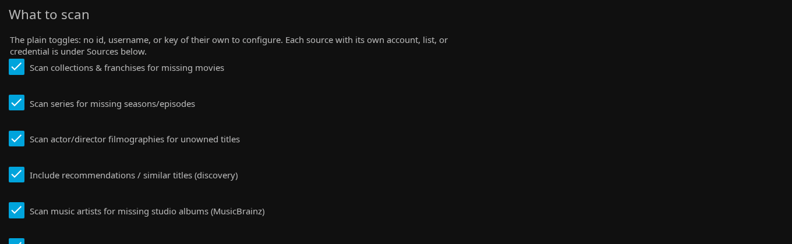

The plain toggles: no id, username, or key of their own. Every source with its own account, list, or
credential is under [Sources](#sources) below.

| Setting                                 | Default | Effect                                                                                                                                         |
| --------------------------------------- | ------- | ---------------------------------------------------------------------------------------------------------------------------------------------- |
| **Collections / franchises**            | On      | Lists the other films in a TMDB collection (box set) you own part of.[^collections]                                                            |
| **Series (missing seasons / episodes)** | On      | Lists the seasons and episodes a series should have that the library is missing, from the series' own metadata.[^series]                       |
| **People (filmographies)**              | On      | Lists films and series from an owned actor, director or writer's TMDB filmography that you do not own.[^people]                                |
| **Recommendations (similar titles)**    | Off     | Lists TMDB "similar" titles for what you own, on the Discover view.[^recommendations]                                                          |
| **Music (artist discographies)**        | On      | Lists the studio albums an owned music artist has on MusicBrainz that you do not own.[^music]                                                  |
| **Books (author bibliographies)**       | On      | Lists the other entries in an owned book's author's OpenLibrary bibliography.[^books]                                                          |
| **Everyone's watchlist**                | Off     | Folds every user's TODO list into one row per title, shown first on the Discover view of every domain it has entries for.[^everyone-watchlist] |

Clearing a setting removes its gaps from the next report.

[^collections]: Your BoxSets need a TMDB id for this to fire.

[^series]: Capped per show by **Max missing episodes per show**. Clearing it removes only the library source; the TVmaze and TheTVDB cross-checks under [TheTVDB](#thetvdb) are separate.

[^people]:
    Films land on Creator works in the Movies domain, series on Creator works in the Shows domain. People are scanned stalest-first in batches capped by **Max creators scanned per run**,
    so coverage accumulates over repeated runs.

[^recommendations]: Can be noisy: this is discovery, not completion. Owned titles are used as seeds stalest-first, capped per run.

[^music]:
    An artist you own an album by becomes a Set-completion "discography" (complete the collection); an artist you only own the odd track by becomes a Creator-works "artist works"
    (discover their wider catalog).

[^books]: Known rough edges: author disambiguation, missing publish years, and duplicate titles (see the roadmap).

[^everyone-watchlist]: Needs no id, username, or key of its own: it reads the same per-user lists the Maintenance section's Fulfillment queue already shows. A title drops off once every user who wanted it marks it done or the library picks it up.

## Sources

Every integration with its own account, list, or credential, one collapsible section per provider: its
toggles, ids, and key all live together instead of being split by what they do. Collapsed by default; a
provider you already use opens on its own and its header badges whether it is on.

In each table below, clearing a toggle stops that source and clearing an id or name leaves the source with
nothing to read. Where clearing does something more specific, the setting's footnote says so.

<strong>TMDB</strong>

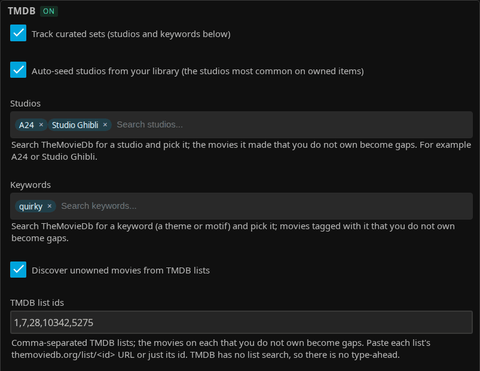

<strong>Trakt</strong>

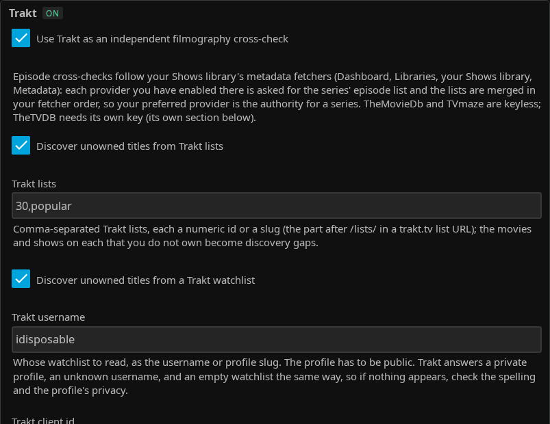

<strong>MDBList</strong>

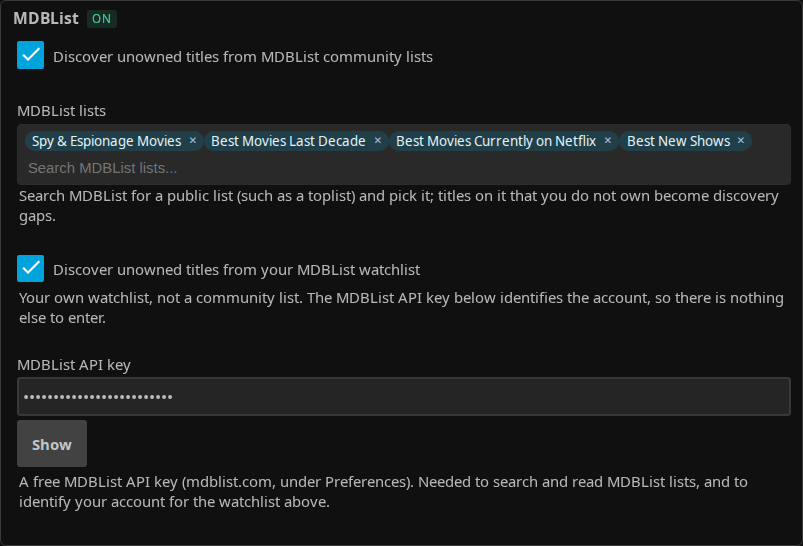

<strong>Discogs</strong>

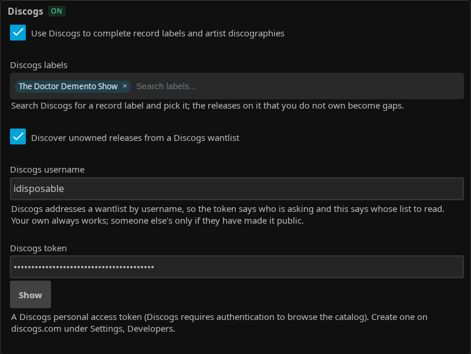

<strong>OpenLibrary</strong>

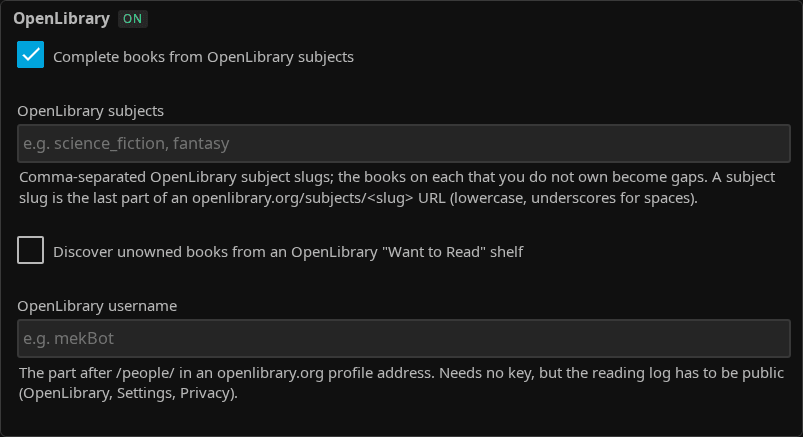

<strong>TheTVDB</strong>

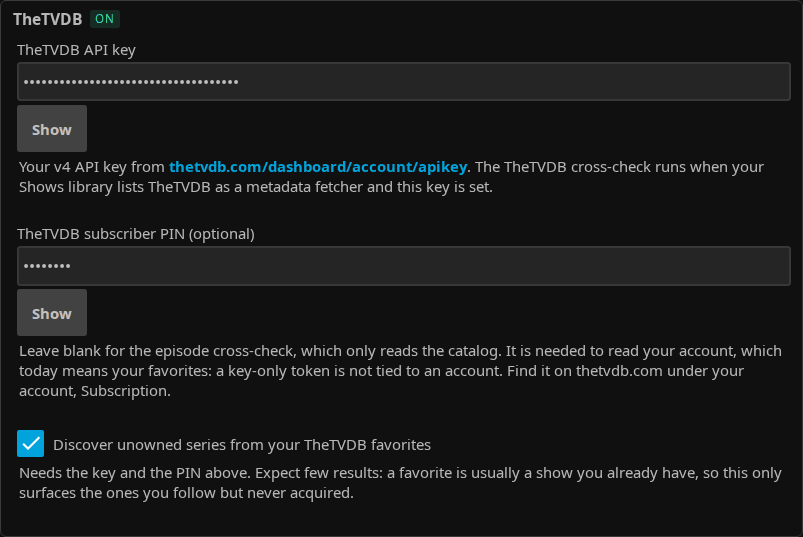

<strong>IMDb</strong>

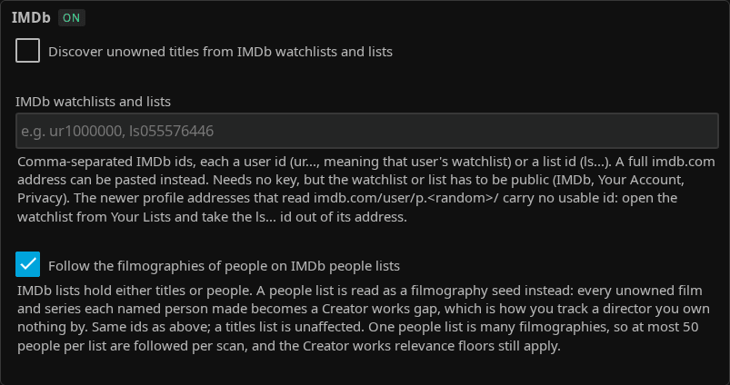

<strong>JustWatch</strong>

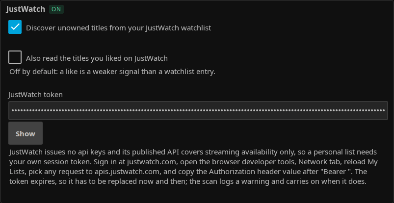

### TMDB

TMDB is always on for the core sources (it powers collections, people, recommendations, and
availability); everything below is opt-in.

| Setting                                     | Default              | Effect                                                                                                                                            |
| ------------------------------------------- | -------------------- | ------------------------------------------------------------------------------------------------------------------------------------------------- |
| **Track curated sets**                      | Off                  | Treats the studios and keywords below as sets to complete: lists films from those TMDB companies and keywords you do not own.[^curatedsets]       |
| **Auto-seed studios from your library**     | Off                  | Tracks the studios most common across your owned movies and series without you picking anything.[^autoseed]                                       |
| **Studios**                                 | Empty                | Search TheMovieDb for a studio and pick a match; each becomes a removable chip.[^studios]                                                         |
| **Keywords**                                | Empty                | Search TheMovieDb for a keyword (a theme or motif) and pick a match; each becomes a chip.[^keywords]                                              |
| **Discover unowned movies from TMDB lists** | Off                  | Surfaces the unowned movies from the TMDB lists named below.[^tmdblists]                                                                          |
| **TMDB list ids**                           | Empty                | Comma-separated TMDB list ids.[^tmdblistids]                                                                                                      |
| **TMDB discover feeds**                     | Off                  | Four independent toggles for TMDB's own Top Rated, Popular, Upcoming and Now Playing feeds; each surfaces its unowned movies on Discover.[^feeds] |
| **Scan TMDB watchlist**                     | Off                  | Surfaces the unowned movies and shows on the connected TheMovieDb account's watchlist.[^tmdbwatchlist]                                            |
| **Also read TMDB favorites**                | Off                  | Reads the account's favorites as well as its watchlist.[^tmdbfavorites]                                                                           |
| **TMDB API key**                            | Empty (built-in key) | Uses your own TMDB v3 key, so lookups draw on your request budget instead of the shared default.[^tmdbkey]                                        |
| **TMDB account**                            | Empty                | Connected with a two-step button: step one opens themoviedb.org to approve, step two finishes in the dashboard.[^tmdbaccount]                     |

[^curatedsets]: Clearing it ignores the curated studios, keywords, and auto-seed below.

[^autoseed]: Combine with the chips or use alone. Only matters when **Track curated sets** is on. Cleared, only the studios and keywords you picked are tracked.

[^studios]: For example A24 or Studio Ghibli. Only the matched TMDB company id is stored. Only matters when **Track curated sets** is on.

[^keywords]: Only the keyword id is stored. Only matters when **Track curated sets** is on.

[^tmdblists]: Separate from **Track curated sets**, so a discovery list can run without the studio and keyword sources. Cleared, the TMDB list ids are ignored.

[^tmdblistids]: A list id is the number in its `themoviedb.org/list/<id>` URL. TMDB has no list search, so paste the id. Only matters when **Discover unowned movies from TMDB lists** is on.

[^feeds]: No account needed, just the TMDB API key below (the built-in default works). Whichever feed you clear stops surfacing.

[^tmdbwatchlist]: Needs **your own TMDB API key** and a connected account (below). No vote floor applies: you put these there deliberately. Cleared, the watchlist is ignored.

[^tmdbfavorites]: Off by default, since a favorite is usually something already owned. Cleared, only the watchlist is read.

[^tmdbkey]:
    Get one at [themoviedb.org/settings/api](https://www.themoviedb.org/settings/api). Also **required** to connect a TMDB account, because a TMDB session belongs to the application
    whose key created it, and the built-in fallback is Jellyfin's own key (a copy of the one in the server's `TmdbUtils.cs`, registered to the Jellyfin project and shared by every install).
    Catalog reads through it are what it is published for; account sessions are not. Cleared, it falls back to the built-in public key, and the TMDB account connect button stays disabled.

[^tmdbaccount]:
    The approval URL carries no redirect, so **nothing calls back into your server and it does not need to be reachable from the internet**. TMDB session ids do not expire,
    so this is a one-time setup. The session can modify your TMDB account, so it is stored as a secret and never displayed. Disconnecting forgets it here; to revoke it at TMDB, remove the
    application under your themoviedb.org account settings.

### Trakt

| Setting                  | Default | Effect                                                                                                                                |
| ------------------------ | ------- | ------------------------------------------------------------------------------------------------------------------------------------- |
| **Trakt cross-check**    | Off     | Adds a Trakt filmography cross-check alongside TMDB, catching credits TMDB misses. Needs the **Trakt client id** below.               |
| **Scan Trakt lists**     | Off     | Surfaces the unowned titles (movies and shows) from the Trakt lists named below. Needs the **Trakt client id** below.                 |
| **Trakt lists**          | Empty   | Comma-separated Trakt lists, each a numeric id or a slug.[^traktlists]                                                                |
| **Scan Trakt watchlist** | Off     | Surfaces the unowned movies and shows on a Trakt user's watchlist. Needs the **Trakt client id** and username below.[^traktwatchlist] |
| **Trakt username**       | Empty   | Whose watchlist to read, as the username or profile slug.[^traktuser]                                                                 |
| **Trakt client id**      | Empty   | Create a free API app at [trakt.tv/oauth/applications](https://trakt.tv/oauth/applications) and paste its Client ID.[^traktid]        |

[^traktlists]: A slug is the part after `/lists/` in a `trakt.tv` list URL; Trakt accepts either. Only matters when **Scan Trakt lists** is on.

[^traktwatchlist]: Trakt serves a public profile's watchlist without OAuth.

[^traktuser]:
    The profile has to be public. Trakt answers a private profile, an unknown username, and an empty watchlist identically (200 with an empty array, and it does not send
    the documented `X-Private-User` header), so a wrong value reads as "nothing on the list" rather than as an error.

[^traktid]:
    Required for the cross-check and every Trakt list and watchlist above (opt-in per Trakt's terms). Cleared, there is no Trakt cross-check and every Trakt list and
    watchlist above stays off.

### MDBList

| Setting                          | Default | Effect                                                                                                                   |
| -------------------------------- | ------- | ------------------------------------------------------------------------------------------------------------------------ |
| **Scan MDBList community lists** | Off     | Surfaces the unowned titles (movies and shows) from the MDBList lists chosen below. Needs the **MDBList API key** below. |
| **MDBList lists**                | Empty   | Search MDBList for a public list and pick a match in the chip box; each becomes a removable chip.[^mdblists]             |
| **Scan MDBList watchlist**       | Off     | Surfaces the unowned movies and shows on the MDBList account's **own** watchlist, not a community list.[^mdbwatchlist]   |
| **MDBList API key**              | Empty   | A free key from [mdblist.com](https://mdblist.com) (under Preferences).[^mdbkey]                                         |

[^mdblists]: Only the chosen list id is stored. Only matters when **Scan MDBList community lists** is on.

[^mdbwatchlist]: The **MDBList API key** identifies the account, so there is no username to enter.

[^mdbkey]: It enables searching and reading MDBList lists, and identifies your account for the watchlist above. Cleared, the MDBList list search, source, and watchlist stay off.

### Discogs

| Setting                                                            | Default | Effect                                                                                                                                         |
| ------------------------------------------------------------------ | ------- | ---------------------------------------------------------------------------------------------------------------------------------------------- |
| **Use Discogs to complete record labels and artist discographies** | Off     | Enables the Discogs label source and a discography pass for an owned artist that carries a Discogs id.[^discogs]                               |
| **Discogs labels**                                                 | Empty   | Search Discogs for a record label and pick a match; each becomes a chip. The releases on that label you do not own become Set-completion gaps. |
| **Scan Discogs wantlist**                                          | Off     | Surfaces the unowned releases on a Discogs wantlist as Music gaps. Needs the **Discogs token** and username below.                             |
| **Discogs username**                                               | Empty   | Whose wantlist to read.[^discogsuser]                                                                                                          |
| **Discogs token**                                                  | Empty   | A Discogs personal access token. Create one on discogs.com under Settings, Developers.[^discogstoken]                                          |

[^discogs]: The label source is the **Discogs labels** picker below, and the discography pass covers artists MusicBrainz cannot resolve. Needs the **Discogs token** below. Cleared, there are no Discogs gaps.

[^discogsuser]: Discogs addresses a wantlist by username, so the token says who is asking and this says whose list; your own always works, someone else's only if they have made it public.

[^discogstoken]: Discogs requires authentication to browse the catalog. Cleared, there are no Discogs gaps at all: the label source, wantlist, and artist-discography pass all need it.

### OpenLibrary

Keyless: every OpenLibrary source below needs only a public list or subject, no credential.

| Setting                                      | Default | Effect                                                                                                                    |
| -------------------------------------------- | ------- | ------------------------------------------------------------------------------------------------------------------------- |
| **Complete books from OpenLibrary subjects** | Off     | Treats the OpenLibrary subjects below as Books sets to complete: lists the books tagged with each subject you do not own. |
| **OpenLibrary subjects**                     | Empty   | Comma-separated OpenLibrary subject slugs.[^subjects]                                                                     |
| **Scan OpenLibrary want to read**            | Off     | Surfaces the unowned works on an OpenLibrary "Want to Read" shelf as Books gaps.                                          |
| **OpenLibrary username**                     | Empty   | The part after `/people/` in an `openlibrary.org` profile address.[^openlibraryuser]                                      |

[^subjects]:
    A slug is the part after `/subjects/` in an `openlibrary.org/subjects/<slug>` URL, lowercase with underscores, for example `science_fiction`. Only matters when
    **Complete books from OpenLibrary subjects** is on.

[^openlibraryuser]: The reading log has to be public, or OpenLibrary serves nothing.

### TheTVDB

| Setting                    | Default | Effect                                                                                                                        |
| -------------------------- | ------- | ----------------------------------------------------------------------------------------------------------------------------- |
| **TheTVDB API key**        | Empty   | Lets the series-content cross-check also consult TheTVDB, for a series your library fetches from TheTVDB.[^tvdbkey]           |
| **TheTVDB subscriber PIN** | Empty   | Optional for the episode cross-check; required to read your **account**, which today means your favorites.[^tvdbpin]          |
| **Scan TheTVDB favorites** | Off     | Surfaces the unowned series favorited on TheTVDB. Needs the **TheTVDB API key** and **subscriber PIN** above.[^tvdbfavorites] |

[^tvdbkey]:
    Requires your own v4 key from [thetvdb.com](https://thetvdb.com/dashboard/account/apikey). TheMovieDb and TVmaze are keyless and run without any setting here; the
    cross-checks share episode ids so duplicates are de-duped, and run stalest-first over runs. Cleared, there is no TheTVDB cross-check (TheMovieDb and TVmaze still run for
    libraries that use them).

[^tvdbpin]:
    The episode cross-check only reads the catalog. A key-only token is not tied to an account, so TheTVDB refuses `/user/favorites` without the PIN. When set it is
    sent on every login, and the resulting token serves the catalog reads too, so there is one login path either way. Cleared, account reads are refused; the episode cross-check
    is unaffected.

[^tvdbfavorites]: Expect few results: a favorite is usually a show you already hold.

### IMDb

Keyless: IMDb's own API serves any list its owner has published, no credential needed.

| Setting                       | Default | Effect                                                                                                                                                                                   |
| ----------------------------- | ------- | ---------------------------------------------------------------------------------------------------------------------------------------------------------------------------------------- |
| **Scan IMDb lists**           | Off     | Surfaces the unowned titles (movies and shows) from the IMDb watchlists and lists named below.                                                                                           |
| **IMDb watchlists and lists** | Empty   | Comma-separated IMDb ids: a user id (`ur1000000`, meaning that user's watchlist) or a list id (`ls055576446`). A full `imdb.com` address holding either can be pasted instead.[^imdbids] |
| **Follow IMDb people lists**  | Off     | Reads a **people** list in the field above as a filmography seed: every unowned film and series each named person made becomes a **Creator works** gap.[^imdbpeople]                     |

[^imdbids]:
    The watchlist or list has to be public (IMDb, Your Account, Privacy), or IMDb answers "permission denied" and the scan logs and skips it. The newer profile addresses
    that read `imdb.com/user/p.<random>/` carry no usable id, because IMDb's API accepts only the `ur` form: open the watchlist from Your Lists and take the `ls` id out of its address.
    Only matters when **Scan IMDb lists** is on.

[^imdbpeople]:
    An IMDb list holds either titles or people, and IMDb says which; a people list is read as a filmography seed instead of a discovery list. This is the only creator
    source not seeded from your library, so it is what tracks a director you own nothing by. One people list is many filmographies, so at most 50 people per list are followed per scan;
    the Creator works relevance floors (minimum votes, cast billing) still apply, and a creator you mute from the report stays muted. Cleared, people lists in the field are skipped;
    titles lists are unaffected.

### JustWatch

| Setting                       | Default | Effect                                                                                                                              |
| ----------------------------- | ------- | ----------------------------------------------------------------------------------------------------------------------------------- |
| **Scan JustWatch watchlist**  | Off     | Surfaces the unowned titles (movies and shows) on the signed-in JustWatch account's watchlist. Needs the **JustWatch token** below. |
| **Also read JustWatch likes** | Off     | Reads the account's liked titles as well as its watchlist.[^justwatchlikes]                                                         |
| **JustWatch token**           | Empty   | Your own session token, since a personal list needs one.[^justwatchtoken]                                                           |

[^justwatchlikes]: Off by default, since a like is a weaker signal than a deliberate watchlist entry. Cleared, only the watchlist is read.

[^justwatchtoken]:
    JustWatch issues no api keys and its published API covers streaming availability only. Sign in at `justwatch.com`, open the browser developer tools, Network tab,
    reload My Lists, pick any request to `apis.justwatch.com`, and copy the `Authorization` header value after `Bearer `. It expires; the scan logs a warning and carries on when it does.
    Cleared, the JustWatch source stays off.

> Note: API keys are sensitive. The key fields are masked (password inputs) with a **Show** toggle to
> reveal one when you need to check it. If a key ever ends up in a URL or browser history, rotate it.

## Where to watch

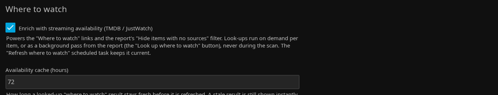

| Setting                             | Default | Effect                                                                                                                        |
| ----------------------------------- | ------- | ----------------------------------------------------------------------------------------------------------------------------- |
| **Availability ("where to watch")** | On      | Enables streaming-availability lookups, which use TMDB `watch/providers` and never run during the scan itself.[^availability] |
| **Availability cache (hours)**      | 24      | How long a looked-up "where to watch" result stays fresh before it is refreshed. Minimum 1.[^availabilitycache]               |

[^availability]:
    That covers the per-row **Where to watch** button, the report's background **Look up where to watch** pass, the **Refresh where to watch** scheduled task, and the
    report's **Hide items with no sources** and per-provider filters. Cleared, the button and the availability filters do nothing, and no provider data is fetched.

[^availabilitycache]:
    A stale result is still served instantly while a refresh runs in the background, so this only trades how current the data is against how often TMDB is hit,
    never responsiveness. Used only when availability is on.

## Images

| Setting                                   | Default | Effect                                                                                                                                                    |
| ----------------------------------------- | ------- | --------------------------------------------------------------------------------------------------------------------------------------------------------- |
| **Keep the pages' images on this server** | Off     | Posters, album and book covers, and streaming-service logos are fetched from their providers once and served from the server's cache folder.[^imagecache] |
| **Image cache size (MB)**                 | 500     | The most the image cache may hold. A scheduled task deletes the oldest images once it is over.[^imagesize]                                                |

[^imagecache]:
    Only images from the providers the plugin reads are kept (TMDB, Cover Art Archive, OpenLibrary, JustWatch, IMDb, Discogs, TheTVDB, TVmaze and MDBList), only real JPEG, PNG, GIF, WebP or AVIF files, and each is limited to 5 MB. The route that serves
    them is open to anyone who can reach the server, since an image tag cannot sign in, so it will not fetch from any other address. Serving an image never waits on anything but its own fetch: when the server cannot have an image at once (it is not held
    and the fetch fails, the provider has been refusing the server, or six fetches are already running) the browser is sent on to the provider with a temporary redirect, so an image still shows for any browser that can reach the provider. A provider that
    fails five fetches in a row is left alone for ten minutes; that list is kept in memory and starts empty after a restart. Off, browsers load every image from its provider directly.

[^imagesize]:
    The images are stored under the server's cache folder, in `mindthegaps/images`. The **Trim the image cache** task, under **Dashboard > Scheduled Tasks**, runs when the server starts and once a day, and deletes the oldest images down to nine tenths of
    this size. Between runs the cache can grow past it; once it is at twice this size nothing more is fetched until the next run. The server's own daily cache task also deletes any file not written for 30 days. Serving an image does not change
    its age, so an image is deleted about a month after it was fetched and the next request fetches it again, which is how a cover the provider has replaced gets picked up. An image whose provider says it is not to be stored (`Cache-Control: no-store` or
    `private`) is never kept.

## Diagnostics

| Setting                  | Default | Effect                                                                                                                                                                       |
| ------------------------ | ------- | ---------------------------------------------------------------------------------------------------------------------------------------------------------------------------- |
| **Detailed API logging** | Off     | Logs every external API request and response to the server log. Turn it on to debug a source or an acquisition target that is not behaving, then turn it back off.[^logging] |

[^logging]:
    It covers the hand-rolled clients through the shared HTTP layer, the acquisition sends, the TMDB calls, and the webhook. Api keys and tokens ride in headers and are never
    logged. Off, there is no request or response logging; failures are still logged.

## Acquisition stack (optional)

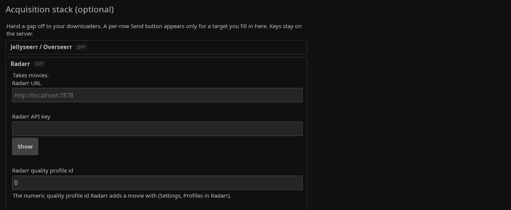

Hand a gap off to your downloaders. Each report row gets a **Send** action, but a button appears only for
a target you have filled in here, one collapsible section per target. Radarr takes a movie, Sonarr takes
the owning series (it grabs that series' missing episodes), and Jellyseerr/Overseerr requests either. A
Radarr or Sonarr row also gets a quality-profile picker beside its Send button, populated from that arr's
own profile list and preselecting the configured default below; picking one overrides the default for that
one send. Keys stay on the server, so the report's **Send** action posts to the plugin and the plugin calls
your downloader. All fields are empty by default, which leaves the matching Send button off.

| Setting                                    | Effect                                                                                                                                               |
| ------------------------------------------ | ---------------------------------------------------------------------------------------------------------------------------------------------------- |
| **Jellyseerr/Overseerr URL** + **API key** | Enables the per-row **Request** action; the title is requested in Jellyseerr/Overseerr.[^seerr]                                                      |
| **Radarr URL** + **API key**               | Enables the per-row **Radarr** action on a missing movie.[^radarr]                                                                                   |
| **Radarr quality profile id**              | The numeric quality profile a sent movie is added with (Settings, Profiles in Radarr). Must be greater than zero for the Radarr handoff.             |
| **Radarr root folder**                     | The root folder a sent movie is added under (for example `/movies`). Required for the Radarr handoff.                                                |
| **Sonarr URL** + **API key**               | Enables the per-row **Sonarr** action on a missing series or episode; the owning series is sent.[^sonarr]                                            |
| **Sonarr quality profile id**              | The numeric quality profile a sent series is added with. Must be greater than zero for the Sonarr handoff.                                           |
| **Sonarr root folder**                     | The root folder a sent series is added under (for example `/tv`). Required for the Sonarr handoff.                                                   |
| **Sonarr monitor**                         | Which episodes Sonarr monitors on add: `all`, `future`, `missing`, `existing`, `firstSeason`, `latestSeason`, `pilot`, or `none`. Defaults to `all`. |

[^seerr]: For example `http://localhost:5055`.

[^radarr]: For example `http://localhost:7878`.

[^sonarr]: For example `http://localhost:8989`. A gap sent this way carries the series' own title, not the name of whatever surfaced it (a filmography credit, a recommendation, or a favorites entry).

A rejected Radarr, Sonarr, or Jellyseerr request shows that service's own validation message (for example
"This movie has already been added") instead of a raw response body, where the service provides one.

## Links

| Setting                     | Default                               | Effect                                                                                                                                                                                                                                                                                                             |
| --------------------------- | ------------------------------------- | ------------------------------------------------------------------------------------------------------------------------------------------------------------------------------------------------------------------------------------------------------------------------------------------------------------------ |
| **Web search URL template** | `https://www.google.com/search?q={0}` | The "Web search" link on a TODO row, a report book/album row, and a Web UI works dialog uses this, with `{0}` replaced by the item's title, year, and creator (the author or artist for a book or album; a title alone is often ambiguous without it). Also drives the always-on Amazon search on those same rows. |
| **Webhook URL**             | Empty                                 | Posts a summary (Discord-compatible `content` payload) when a scan or the availability pass finishes. Leave blank to disable.                                                                                                                                                                                      |

## Region

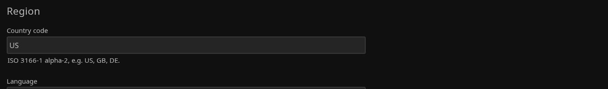

| Setting          | Default | Effect                                                                                                                             |
| ---------------- | ------- | ---------------------------------------------------------------------------------------------------------------------------------- |
| **Country code** | `US`    | ISO 3166-1 alpha-2 (e.g. `US`, `GB`, `DE`). Drives release dates and which country's streaming providers "where to watch" reports. |
| **Language**     | `en`    | ISO 639-1 (e.g. `en`, `de`). Language of titles and overviews fetched from TMDB.                                                   |

## Limits

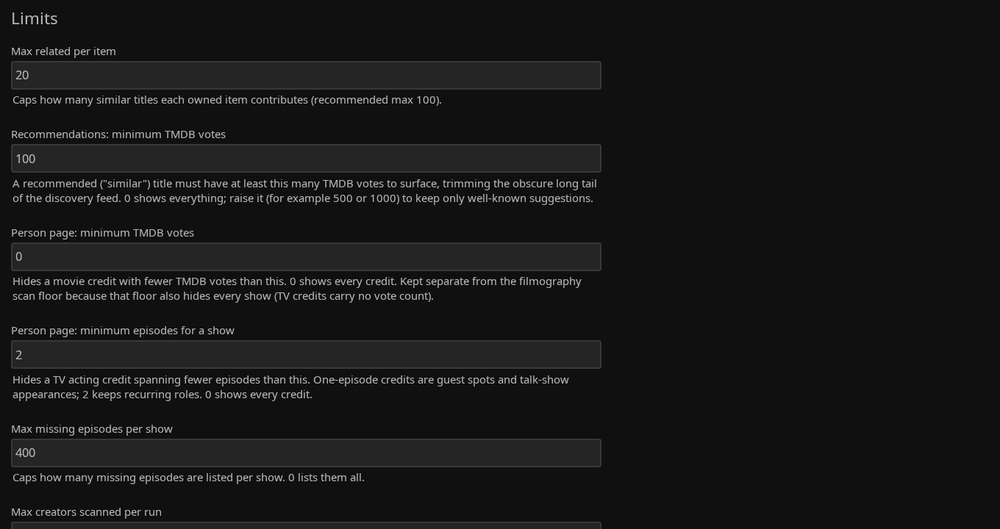

These bound how much each scan produces, so one prolific show or a huge cast does not flood the list.

| Setting                                      | Default | Effect                                                                                                                         |
| -------------------------------------------- | ------- | ------------------------------------------------------------------------------------------------------------------------------ |
| **Max related per item**                     | 20      | Caps how many "similar" titles each owned item contributes to recommendations.                                                 |
| **Recommendations: minimum TMDB votes**      | 100     | A recommended ("similar") title must have at least this many TMDB votes to surface, trimming the obscure long tail.[^recvotes] |
| **Person page: minimum TMDB votes**          | 0       | Hides a movie credit on a filmography scan with fewer TMDB votes than this.[^personvotes]                                      |
| **Person page: minimum episodes for a show** | 2       | Hides a TV acting credit spanning fewer episodes than this.[^personepisodes]                                                   |
| **Max missing episodes per show**            | 200     | Caps missing episodes listed per show. `0` lists them all.                                                                     |
| **Max creators scanned per run**             | 1000    | Caps how many owned people have their filmography scanned per run.[^maxpeople]                                                 |
| **Filmography: minimum TMDB votes**          | 100     | A cast credit must have at least this many TMDB votes to surface as a Creator works gap.[^filmvotes]                           |
| **Filmography: deepest cast billing**        | 0 (any) | Drops minor (deeply billed) acting roles so a bit part is not counted as the person's work.[^billing]                          |

[^recvotes]: `0` shows everything; raise it (for example 500 or 1000) to keep only well-known suggestions.

[^personvotes]:
    `0` shows every credit. Kept separate from the recommendations floor above and from **Filmography: minimum TMDB votes** below, because a TV credit carries no vote count and
    would otherwise be hidden by a floor meant for movies.

[^personepisodes]: One-episode credits are guest spots and talk-show appearances; `2` keeps recurring roles. `0` shows every credit.

[^maxpeople]:
    People are scanned stalest-first (never-scanned first, then longest-ago), so a lower cap still eventually covers everyone over successive runs; raise it to cover a large cast
    and crew faster (each person is one cached TMDB lookup).

[^filmvotes]:
    This keeps the list actionable on a large library by dropping obscure and unreleased films. `0` shows everything; raise it (for example 500 or 1000) to trim to only well-known
    films. Directing and writing credits are always shown (TMDB's filmography crew carries no vote count).

[^billing]: `0` keeps any billing; for example `10` keeps only roles billed in the top 10. Does not affect directing or writing.

**Reset scan rotation** (button). Forgets which items were scanned recently so the next scan starts a
fresh coverage cycle, treating everything as never-scanned. It does not delete any gaps or dismissals.
You rarely need it: each scan automatically prunes rotation entries for items that have left the
library, so the table stays the size of the library on its own. Use it after raising a cap, or if you
suspect the rotation is stuck.

**Prune stale gaps** (button, in the report page's Maintenance section). Removes the gaps left behind by a
source you have since taken out of the settings: a keyword or company id you deleted, a list you dropped,
or a whole source you turned off, such as the Trakt watchlist. It only reads your settings and makes no
network call. Every scan does the same thing automatically, so the button is for cleaning up right after an
edit without waiting for the next scan. Sources that rotate through your library (creators, series
content, recommendations) are not pruned this way.

## Web UI (experimental)

Off by default. Adds sections to Jellyfin Web's own pages, and serves the data behind them from the
plugin's API.

| Setting                                                | Default         | Effect                                                                                                                                                                                                                               |
| ------------------------------------------------------ | --------------- | ------------------------------------------------------------------------------------------------------------------------------------------------------------------------------------------------------------------------------------ |
| **Show the surfaces in Jellyfin Web**                  | Off             | Adds the client script to Jellyfin Web at request time, so the surfaces you turn on below appear on its pages.[^webuiscript]                                                                                                         |
| **Person pages**                                       | Off             | A "Missing from your library" section on a person's page: the movies and series they are credited on that you do not own.[^personpage]                                                                                               |
| **Item pages**                                         | Off             | A "More like this you don't have" row on an owned movie or series page, an "Albums you don't have" row on a music artist's page, and a "More by this author you don't have" row on a book's page.[^itempage]                         |
| **Home screen**                                        | Off             | A "Discover: not in your library" row of recommendations from your owned titles and from public lists.[^homerow]                                                                                                                     |
| **Home Discover row: max titles**                      | 20              | The most titles the row shows (1 to 100).                                                                                                                                                                                            |
| **Want to watch**                                      | Off             | Each signed-in user's own list: a bookmark on every card the surfaces above show, a home row of what is still on it and not in the library, and a title search in that row's header for a title no page already lists.[^wanttowatch] |
| **Want to watch: move arrived titles into a playlist** | Off             | Once a title is actually in the library (a real file; minting never counts), the next time it is verified it moves into that user's own Jellyfin playlist too, so it shows up to watch in every client.[^wanttowatchplaylist]        |
| **Want to watch: playlist name**                       | "Want to Watch" | Each user gets their own playlist by this name, created the first time they need one.                                                                                                                                                |

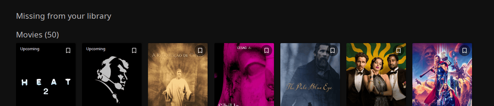

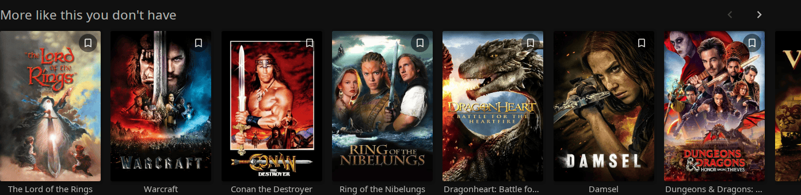

A series page carries the same row:

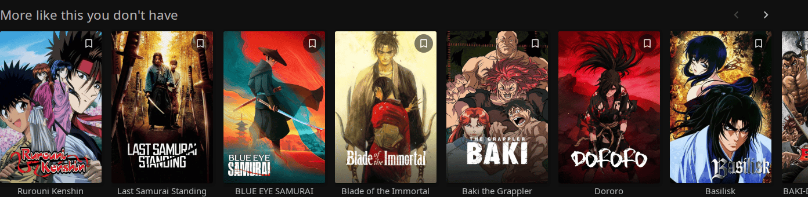

A music artist's page shows the same row as "Albums you don't have", and a book's page as "More by this
author you don't have":

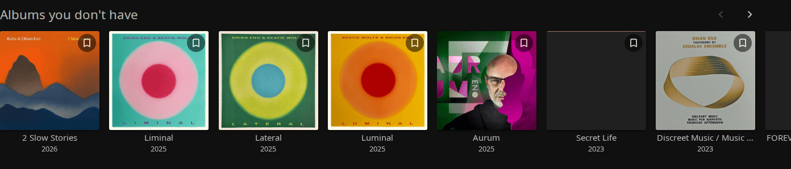

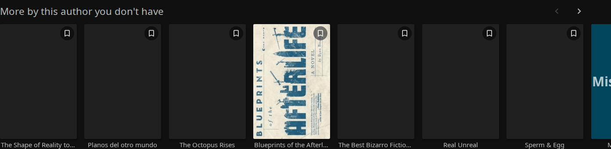

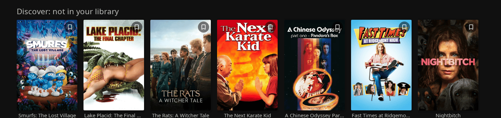

[^webuiscript]:
    Jellyfin Web has no plugin hook, so the script is added when the page is served. Takes effect on the next full page load. It does not affect whether a surface's
    data is served.

[^personpage]: See **Person page** under [Limits](#limits) to trim what counts as a credit.

[^itempage]:
    The movie and series row comes from TMDB's recommendations for the title and uses **Max related per item** and **Recommendations: minimum TMDB votes** under
    [Limits](#limits). The artist and book rows run the same sources as the report's re-check, so they need the music or books scan on and an artist or book carrying a
    MusicBrainz, Discogs or OpenLibrary id.

[^homerow]:
    The recommendations are the ones the last scan accumulated from your owned titles, plus titles from TMDB lists, Trakt lists and TMDB's own feeds (nothing from a
    watchlist, favorites, or an IMDb or MDBList list), ranked by how many owned titles suggest each one, then by TMDB popularity. It reads the report, so it makes no TMDB call
    when the home page loads.

[^wanttowatch]:
    A user with a parental rating limit does not get the surfaces, so has no cards to bookmark from. An administrator sees everyone's lists folded into one queue from the
    report's Maintenance section (the **Fulfillment queue**), and can verify or mark a title fetched for everyone still waiting on it in one action.

[^wanttowatchplaylist]: The move happens the next time the entry is verified, not the instant the file arrives: an administrator's Fulfillment queue **Verify all**, or any future per-user verify. A title moves once, the first time it is found owned; verifying again does not add it a second time. Minting a placeholder never counts as arrived, whether or not minting is on elsewhere in the plugin.

Click a card for a detail dialog with TMDB's synopsis, genres, runtime, rating, a trailer link, and
JustWatch (the title's own page when a report gap carries one, else a search in your configured region).
With **Want to watch** on, every card also has a bookmark, and the dialog a matching button, that put the
title on the signed-in user's own list and take it off again. An album's or book's dialog shows who it is
by and links to MusicBrainz, Discogs or OpenLibrary. There is no acquisition handoff on any of these pages,
by design: an administrator monitors what everyone wants from the report's own **Fulfillment queue**
(under Maintenance) and fetches it themselves, or sends it from the report's own per-row **Send** action
(see [Acquisition stack](#acquisition-stack-optional) above), rather than this surface talking to Radarr
or Sonarr directly. The dialog and the card grids work from a keyboard or a TV remote.

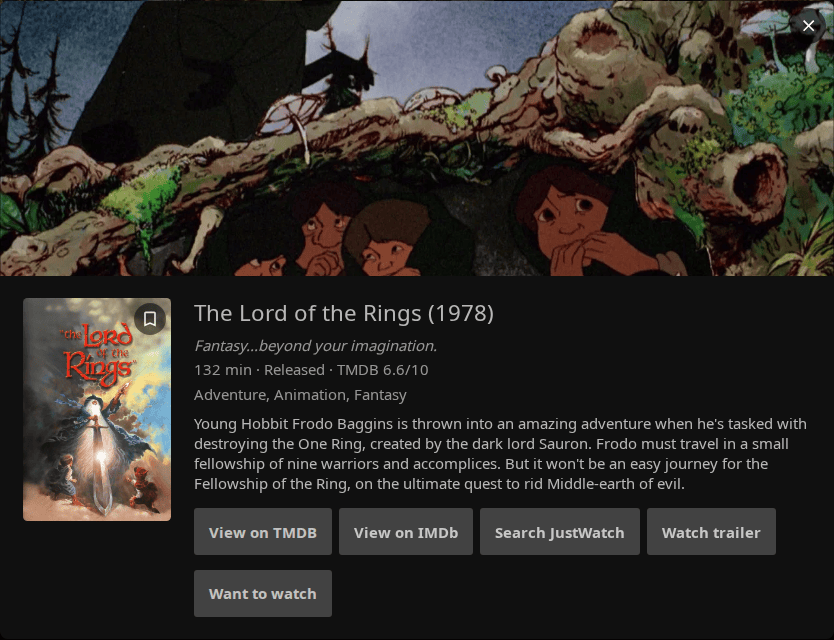

The "Want to watch" row's own header also carries a search box (a kind picker plus a text field), for a
movie or series no page already lists to add directly.

A bookmarked card and the home page's "Want to watch" row of what is still on the list:

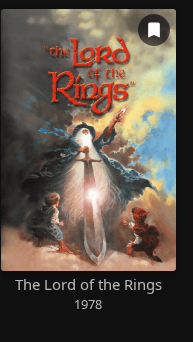

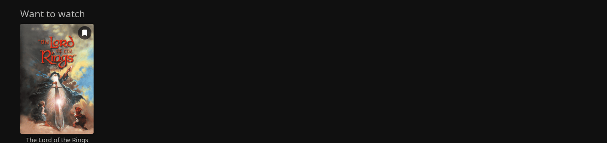

### The data is an API

Each surface's data is served by the plugin whether or not the script is added, so another client can use it:

- `GET MindTheGaps/Person/{personId}/Missing`, `GET MindTheGaps/Item/{itemId}/Related` and
  `GET MindTheGaps/Home/Discover`, each answering 404 until its own toggle is on.
- `GET MindTheGaps/WebUi/Detail?tmdbId=&kind=` (`kind` is `Movie` or `Series`), a proxied TMDB lookup for a
  title, always available. There is no send-to-Radarr/Sonarr endpoint here; that stays on the report (see
  [Acquisition stack](#acquisition-stack-optional)).
- With **Want to watch** on, any signed-in user can put a title on their own list and take it off
  (`POST .../Todo` and `POST .../Todo/Remove` on each surface), and read the home row of what is still on it
  (`GET MindTheGaps/Home/Wanted`). A request that is not a user's, such as one made with an API key, has no
  list.
- The home row's own header carries a title search, for a movie or series no page already lists:
  `GET MindTheGaps/Home/Search?kind=&q=` (`kind` is `Movie` or `Series`) searches TMDB, filtered to what the
  library does not already hold, and `POST MindTheGaps/Home/Search/Todo`/`.../Todo/Remove?kind=&tmdbId=` add
  or remove a result, rehydrated fresh from TMDB by id rather than trusted from the client.

All the reads are open to any signed-in user, and the shapes are experimental and may change. They are
filtered lightly by who is asking: a user with a parental rating limit is not shown the surfaces at all, and
a page is shown only to a user who can see the item it is about. Beyond that a title is listed if the
library does not hold it, for everyone, whatever the caller's library access. Per-title certification
filtering is not done, because TMDB's certifications would cost a request per title. The Discover row shows
only recommendations made from titles you own and titles from public lists (TMDB lists, Trakt lists and
TMDB's own feeds), never those from a watchlist, favorites, or an IMDb or MDBList list. See
[ADR-0019](adr/0019-web-ui-surfaces-are-an-api.md).

## Virtual items

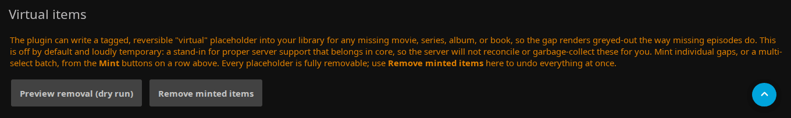

Off by default and clearly marked. Lets the plugin mint pathless "virtual" placeholder items so a gap
renders greyed-out in place, and reconcile/remove them. This is a stand-in for proper server support;
everything minted is tagged and fully reversible. See the
[virtual placeholders section of the README](../README.md#virtual-placeholders-opt-in)
and [ADR-0004](adr/) for the rationale, and the [report guide](report-guide.md) for the per-row Mint
controls. There is no setting to flip: minting acts on the library and the scan, not on configuration, so
its one bulk control, **Remove minted items** (with a **Preview removal (dry run)** first), lives in the
report's own **Maintenance** section alongside **Reset scan rotation** and **Prune stale gaps**.

## How settings reach a report

Configuration changes apply to the **next** scan, not the report already on screen. The persisted
report carries the plugin version it was generated with, so after a plugin upgrade the dashboard nudges
you to rescan (the gap ids and links are a stable contract; see [ADR-0008](adr/)). Press **Rescan now**
on the report to apply changes immediately, or let the scheduled task pick them up.

## Setting keys

The key each setting has in the plugin's configuration file, sorted by setting name.

| Setting                                                        | Key                          | Section                                          |
| -------------------------------------------------------------- | ---------------------------- | ------------------------------------------------ |
| Also read JustWatch likes                                      | `ScanJustWatchLikes`         | [JustWatch](#justwatch)                          |
| Also read TMDB favorites                                       | `ScanTmdbFavorites`          | [TMDB](#tmdb)                                    |
| Auto-seed studios from your library                            | `AutoSeedStudios`            | [TMDB](#tmdb)                                    |
| Availability ("where to watch")                                | `IncludeAvailability`        | [Where to watch](#where-to-watch)                |
| Availability cache (hours)                                     | `AvailabilityCacheHours`     | [Where to watch](#where-to-watch)                |
| Books (author bibliographies)                                  | `ScanBooks`                  | [What to scan](#what-to-scan)                    |
| Collections / franchises                                       | `ScanCollections`            | [What to scan](#what-to-scan)                    |
| Complete books from OpenLibrary subjects                       | `ScanCuratedBooks`           | [OpenLibrary](#openlibrary)                      |
| Country code                                                   | `MetadataCountryCode`        | [Region](#region)                                |
| Detailed API logging                                           | `DetailedApiLogging`         | [Diagnostics](#diagnostics)                      |
| Discogs labels                                                 | `DiscogsLabelIds`            | [Discogs](#discogs)                              |
| Discogs token                                                  | `DiscogsToken`               | [Discogs](#discogs)                              |
| Discogs username                                               | `DiscogsUsername`            | [Discogs](#discogs)                              |
| Discover unowned movies from TMDB lists                        | `ScanTmdbLists`              | [TMDB](#tmdb)                                    |
| Everyone's watchlist                                           | `ScanEveryoneWatchlist`      | [What to scan](#what-to-scan)                    |
| Filmography: deepest cast billing                              | `MaxCastBillingOrder`        | [Limits](#limits)                                |
| Filmography: minimum TMDB votes                                | `MinFilmographyVotes`        | [Limits](#limits)                                |
| Follow IMDb people lists                                       | `ScanImdbPeopleLists`        | [IMDb](#imdb)                                    |
| Home Discover row: max titles                                  | `HomeRowSize`                | [Web UI](#web-ui-experimental)                   |
| Home screen                                                    | `HomeRowEnabled`             | [Web UI](#web-ui-experimental)                   |
| Image cache size (MB)                                          | `ImageCacheMaxMegabytes`     | [Images](#images)                                |
| IMDb watchlists and lists                                      | `ImdbListIds`                | [IMDb](#imdb)                                    |
| Item pages                                                     | `ItemPageEnabled`            | [Web UI](#web-ui-experimental)                   |
| Jellyseerr/Overseerr API key                                   | `SeerrApiKey`                | [Acquisition stack](#acquisition-stack-optional) |
| Jellyseerr/Overseerr URL                                       | `SeerrUrl`                   | [Acquisition stack](#acquisition-stack-optional) |
| JustWatch token                                                | `JustWatchToken`             | [JustWatch](#justwatch)                          |
| Keep the pages' images on this server                          | `ImageCacheEnabled`          | [Images](#images)                                |
| Keywords                                                       | `CuratedKeywordIds`          | [TMDB](#tmdb)                                    |
| Language                                                       | `MetadataLanguage`           | [Region](#region)                                |
| Max creators scanned per run                                   | `MaxFilmographyPeople`       | [Limits](#limits)                                |
| Max missing episodes per show                                  | `MaxMissingEpisodesPerShow`  | [Limits](#limits)                                |
| Max related per item                                           | `MaxRelatedPerItem`          | [Limits](#limits)                                |
| MDBList API key                                                | `MdbListApiKey`              | [MDBList](#mdblist)                              |
| MDBList lists                                                  | `MdbListListIds`             | [MDBList](#mdblist)                              |
| Music (artist discographies)                                   | `ScanMusic`                  | [What to scan](#what-to-scan)                    |
| OpenLibrary subjects                                           | `CuratedOpenLibrarySubjects` | [OpenLibrary](#openlibrary)                      |
| OpenLibrary username                                           | `OpenLibraryUsername`        | [OpenLibrary](#openlibrary)                      |
| People (filmographies)                                         | `ScanPeople`                 | [What to scan](#what-to-scan)                    |
| Person page: minimum episodes for a show                       | `PersonPageMinEpisodes`      | [Limits](#limits)                                |
| Person page: minimum TMDB votes                                | `PersonPageMinVotes`         | [Limits](#limits)                                |
| Person pages                                                   | `PersonPageEnabled`          | [Web UI](#web-ui-experimental)                   |
| Radarr API key                                                 | `RadarrApiKey`               | [Acquisition stack](#acquisition-stack-optional) |
| Radarr quality profile id                                      | `RadarrQualityProfileId`     | [Acquisition stack](#acquisition-stack-optional) |
| Radarr root folder                                             | `RadarrRootFolderPath`       | [Acquisition stack](#acquisition-stack-optional) |
| Radarr URL                                                     | `RadarrUrl`                  | [Acquisition stack](#acquisition-stack-optional) |
| Recommendations (similar titles)                               | `ScanRecommendations`        | [What to scan](#what-to-scan)                    |
| Recommendations: minimum TMDB votes                            | `MinRecommendationVotes`     | [Limits](#limits)                                |
| Scan Discogs wantlist                                          | `ScanDiscogsWantlist`        | [Discogs](#discogs)                              |
| Scan IMDb lists                                                | `ScanImdbLists`              | [IMDb](#imdb)                                    |
| Scan JustWatch watchlist                                       | `ScanJustWatchLists`         | [JustWatch](#justwatch)                          |
| Scan MDBList community lists                                   | `ScanMdbList`                | [MDBList](#mdblist)                              |
| Scan MDBList watchlist                                         | `ScanMdbListWatchlist`       | [MDBList](#mdblist)                              |
| Scan OpenLibrary want to read                                  | `ScanOpenLibraryWantToRead`  | [OpenLibrary](#openlibrary)                      |
| Scan TheTVDB favorites                                         | `ScanTvdbFavorites`          | [TheTVDB](#thetvdb)                              |
| Scan TMDB watchlist                                            | `ScanTmdbWatchlist`          | [TMDB](#tmdb)                                    |
| Scan Trakt lists                                               | `ScanTraktLists`             | [Trakt](#trakt)                                  |
| Scan Trakt watchlist                                           | `ScanTraktWatchlist`         | [Trakt](#trakt)                                  |
| Series (missing seasons / episodes)                            | `ScanSeries`                 | [What to scan](#what-to-scan)                    |
| Show the surfaces in Jellyfin Web                              | `WebUiEnabled`               | [Web UI](#web-ui-experimental)                   |
| Sonarr API key                                                 | `SonarrApiKey`               | [Acquisition stack](#acquisition-stack-optional) |
| Sonarr monitor                                                 | `SonarrMonitor`              | [Acquisition stack](#acquisition-stack-optional) |
| Sonarr quality profile id                                      | `SonarrQualityProfileId`     | [Acquisition stack](#acquisition-stack-optional) |
| Sonarr root folder                                             | `SonarrRootFolderPath`       | [Acquisition stack](#acquisition-stack-optional) |
| Sonarr URL                                                     | `SonarrUrl`                  | [Acquisition stack](#acquisition-stack-optional) |
| Studios                                                        | `CuratedCompanyIds`          | [TMDB](#tmdb)                                    |
| TheTVDB API key                                                | `TvdbApiKey`                 | [TheTVDB](#thetvdb)                              |
| TheTVDB subscriber PIN                                         | `TvdbPin`                    | [TheTVDB](#thetvdb)                              |
| TMDB account                                                   | `TmdbSessionId`              | [TMDB](#tmdb)                                    |
| TMDB API key                                                   | `TmdbApiKey`                 | [TMDB](#tmdb)                                    |
| TMDB discover feeds: Now Playing                               | `ScanTmdbNowPlaying`         | [TMDB](#tmdb)                                    |
| TMDB discover feeds: Popular                                   | `ScanTmdbPopular`            | [TMDB](#tmdb)                                    |
| TMDB discover feeds: Top Rated                                 | `ScanTmdbTopRated`           | [TMDB](#tmdb)                                    |
| TMDB discover feeds: Upcoming                                  | `ScanTmdbUpcoming`           | [TMDB](#tmdb)                                    |
| TMDB list ids                                                  | `CuratedTmdbListIds`         | [TMDB](#tmdb)                                    |
| Track curated sets                                             | `ScanCuratedSets`            | [TMDB](#tmdb)                                    |
| Trakt client id                                                | `TraktClientId`              | [Trakt](#trakt)                                  |
| Trakt cross-check                                              | `TraktEnabled`               | [Trakt](#trakt)                                  |
| Trakt lists                                                    | `CuratedTraktListIds`        | [Trakt](#trakt)                                  |
| Trakt username                                                 | `TraktUsername`              | [Trakt](#trakt)                                  |
| Use Discogs to complete record labels and artist discographies | `ScanDiscogs`                | [Discogs](#discogs)                              |
| Want to watch                                                  | `WantToWatchEnabled`         | [Web UI](#web-ui-experimental)                   |
| Want to watch: move arrived titles into a playlist             | `WantToWatchPlaylistEnabled` | [Web UI](#web-ui-experimental)                   |
| Want to watch: playlist name                                   | `WantToWatchPlaylistName`    | [Web UI](#web-ui-experimental)                   |
| Web search URL template                                        | `SearchUrlTemplate`          | [Links](#links)                                  |
| Webhook URL                                                    | `WebhookUrl`                 | [Links](#links)                                  |
