# Using the report

The report is the plugin's "todo list" of what is missing or worth adding. Open it from
**Dashboard > Mind the Gaps** (a left-nav entry under the server dashboard). This page explains the
layout, the three pattern tabs, the shared toolbar, and the per-row actions. For the settings that feed
it, see the [configuration reference](configuration.md).

## Layout at a glance

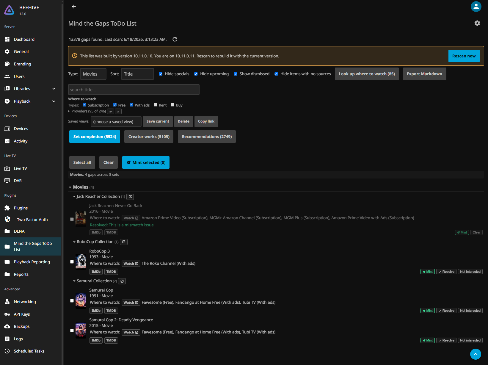

- **Summary line** at the top: how many gaps, when the report was generated, and a reload button that
  re-reads the last saved results without rescanning.
- **Stale banner** (amber): shown when the report was generated by an older plugin version, with a
  **Rescan now** button. The gap ids and links are a stable contract, so a rescan after an upgrade
  keeps your dismissals and enrichment.
- **Rescan now**: runs a full scan in the background and shows progress. A scan can take a while; the
  page polls and reloads when it finishes. Scans also run on a schedule (**Dashboard > Scheduled
  Tasks**).
- **Toolbar**: filters, search, saved views, export, **Explore a source** (below).
- **Pattern tabs**: Set completion, Creator works, Recommendations (below). Only tabs with gaps show.
- **A-Z jump bar** and **rollup**: on the letter-grouped tabs, for quick navigation.
- **Back to top** button, bottom-right.

A scan runs in the background with live progress:

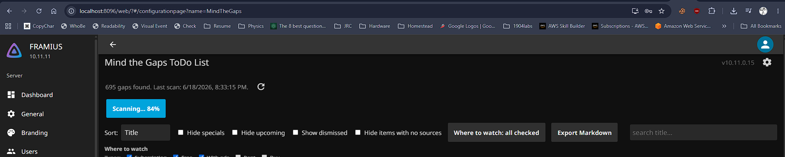

Scans also run on a schedule, alongside a "Refresh where to watch" pass, under **Dashboard > Scheduled Tasks**:

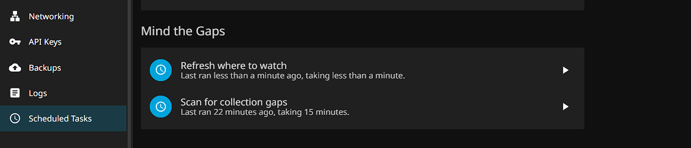

## The three pattern tabs (axes)

The report is split by *pattern*, the kind of gap. Each tab groups by media domain (**Movies** /
**Shows**, and **Music** / **Books** when those sources are on), so you can work one axis
at a time.

### Set completion

Things that belong to a set you partly own: movies missing from a **collection/franchise**, **seasons
and episodes** missing from a series, and missing entries from **curated studio/keyword sets**. Grouped
by domain, then by the set (the collection, the series, the studio). This is the "finish what I
started" axis.

Each row is a concrete missing title with links out (TMDB/IMDb/TheTVDB as applicable) and, for movies,
a **Mint** action if you have enabled virtual items.

The collapsed series and collections lay out in responsive columns, so a large library is not one very
tall list; expanding one widens it to full width in place to show its seasons and episodes. On a
collapsed series, the batch controls appear on hover.

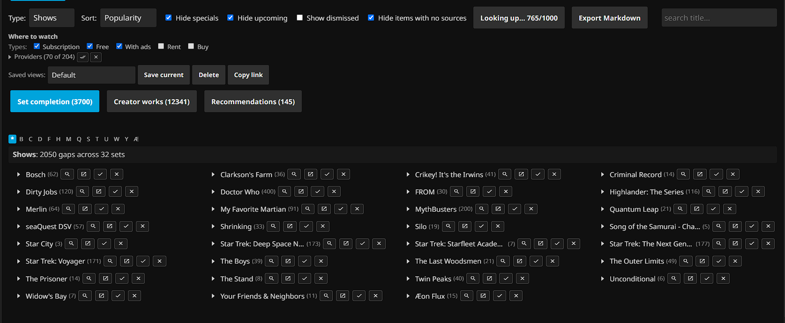

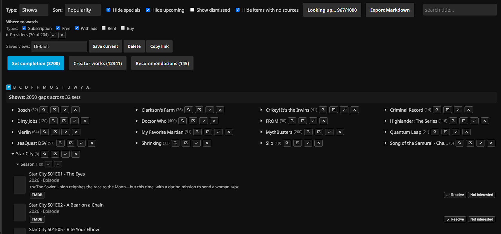

With the **music** source on, an album artist you collect is a Set-completion gap too: their
missing studio albums (a "discography").

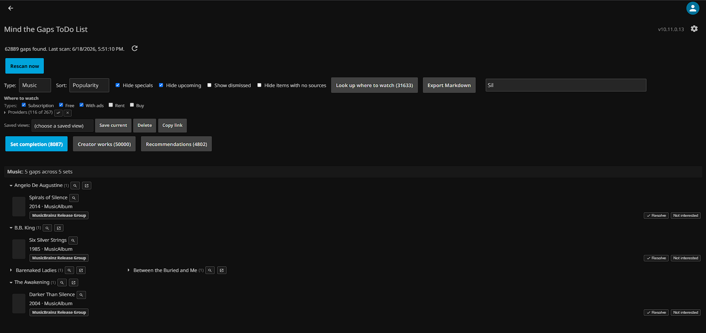

### Creator works

Films and series from an owned person's **filmography** (actor/director/writer) that you do not own.
Films land in the Movies domain and series in the Shows domain, both on this tab. Grouped by domain, then
alphabetically by the creator's initials, then by creator, then the missing titles.

Because filmographies are scanned stalest-first in capped batches, this list **accumulates** over
several scans rather than appearing all at once. A creator you are not collecting can be muted wholesale
(see [Muting a whole creator or source](#muting-a-whole-creator-or-source)).

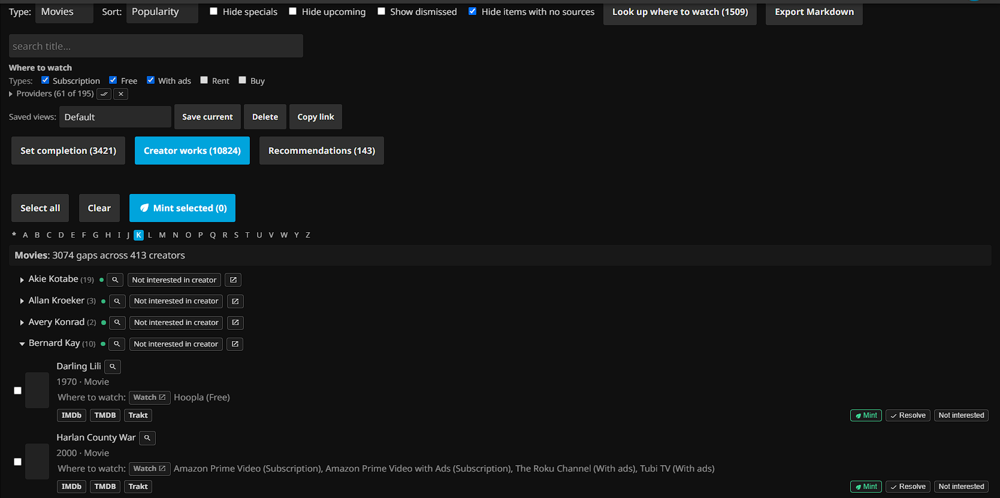

The A-Z bar across the top selects one initial at a time, so even a very large filmography opens quickly.

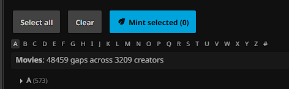

With the **music** source on, a track-only artist's wider catalogue ("artist works") appears here too.

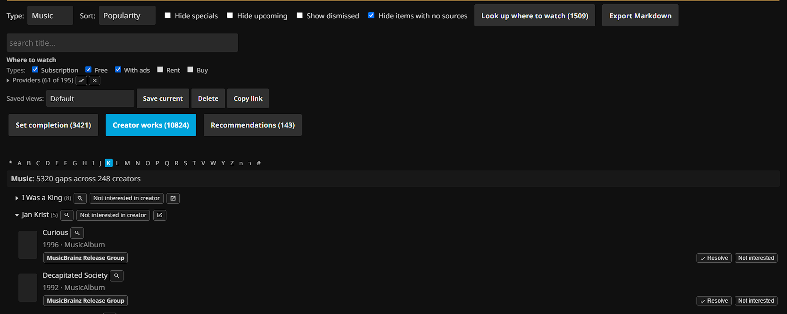

### Recommendations

TMDB "similar" titles for things you own, that you do not own, plus the unowned titles from any curated
TMDB or MDBList list you have added. This is **discovery**, not completion, so it is off by default and
can be noisy. Grouped by domain, then alphabetically by the title, with the seed title shown so you know
why something was suggested. A curated list shows as its own group; a title that is both on a list and
recommended groups under the list, with the recommendation kept as a secondary source. A seed you do not
want suggestions from can be muted (the small x on a recommendation, or the picker described below).

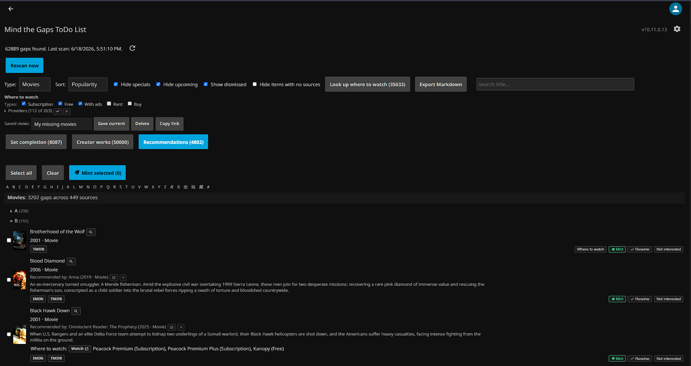

Shows work the same way:

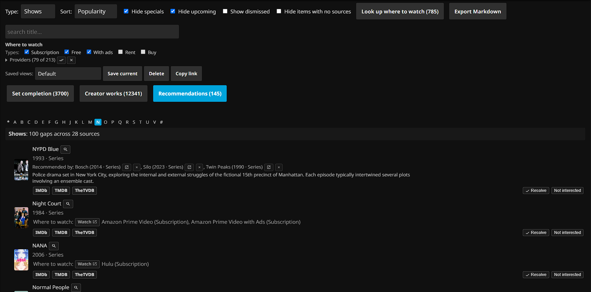

## Toolbar: filters, search, views

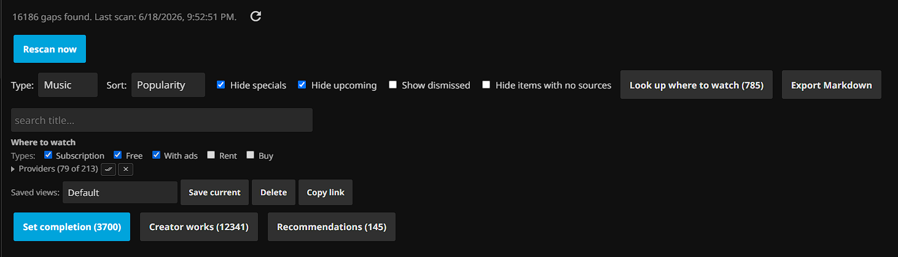

The toolbar applies to the current tab. Filters combine (a row must pass all of them).

| Control | What it does |
|---|---|
| **Type** (domain) | Pick the media domain to view: Movies, Shows, Music, Books, or Music videos, listed only when the current tab actually has gaps in them (so Music shows up on Set completion, Books on Creator works). It is the primary selector, so there is no "All" and you view one domain at a time; the control hides itself when a tab has a single domain. |
| **Sort** | Reorder rows (for example by title or year). |
| **Hide specials** | Drop season-0 / special episodes. |
| **Hide upcoming** | Drop gaps whose release date is in the future (not yet acquirable). |
| **Show dismissed** | Reveal gaps you dismissed; each appears greyed with its status (resolved / not interested / snoozed) and a **Clear** button. Off by default, so dismissed rows stay hidden. |
| **Hide items with no sources** | Hide gaps with no "where to watch" match for your provider filter. Needs availability data first (see below). |
| **Look up where to watch** | Kicks off the background availability pass: fetches streaming providers for the gaps that do not have them yet, in batches, filling in as it goes. Grouped by watch target, so every episode of a series shares one lookup. The button shows how many titles still need a lookup ("Look up where to watch (N)"), reports live progress while running ("Looking up... 45/320"), and reads "Where to watch: all checked" (disabled) once the backlog is cleared. Requires **Availability** enabled in settings. |
| **Provider filter** | When availability data is present, filter to specific streaming providers. |
| **Export Markdown** | Download the current tab, as filtered, as a Markdown file with links. |
| **Search** | Free-text filter on the title. |
| **Saved views** | Save the current set of filters under a name and re-apply later; **Save current** / **Delete**. Views are stored per browser. |
| **Copy link** | Copy a URL that re-opens this exact view (active tab plus every filter) when pasted into another browser or shared. Opening such a link applies the view once, then drops the marker from the address bar so a later reload uses your own saved filters. Unlike a saved view, the link is not tied to one browser. |
| **Explore a source** | Open a modal that pulls the unowned titles from one source right now and merges them into the report, without a full rescan and without changing your saved settings. See [Explore a source on demand](#explore-a-source-on-demand). |

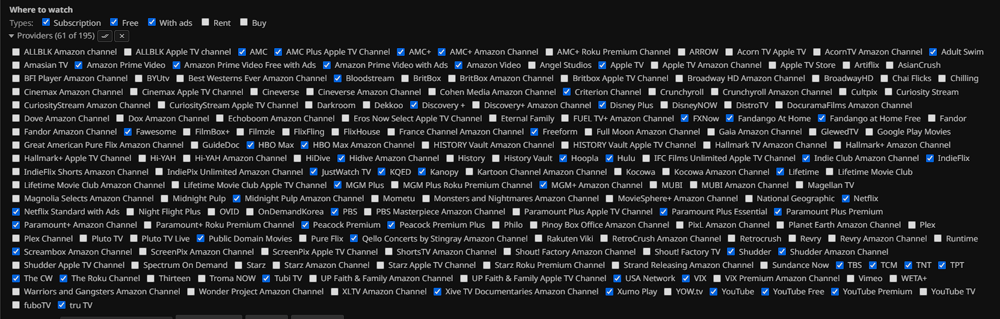

## Per-row actions

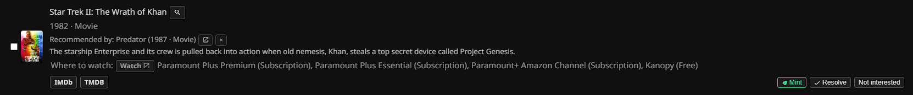

Each gap row carries links and actions. Which appear depends on the gap's kind and your settings.

- **Open in Jellyfin**: jumps to the item in your library where one exists (for example the owning
  series of a missing episode).
- **Search (magnifying glass)**: opens a Jellyfin search for that title (or series, collection, or
  creator) in a new tab, scoped to the right library type (movies, shows, music, books, music videos,
  or box sets; a creator searches everywhere). Handy to confirm you do not already hold it under another
  name, or to find it on a federated server.
- **Diagnose** (movie and show rows): explains why the row is reported missing, most often an owned copy
  under the wrong id. See [Diagnose](#diagnose-is-it-really-missing) below.
- **Where to watch / Watch**: streaming-availability links. If a row has not been looked up yet, the
  button fetches it on demand; the background **Look up where to watch** pass does many at once.
- **Send** (when an acquisition target is configured): hands the gap off to your downloaders. A
  **Radarr** button sends a missing movie, a **Sonarr** button sends the owning series of a missing
  series or episode (Sonarr grabs that series' missing episodes), and a **Request** button hands either
  off to Jellyseerr/Overseerr. A button appears only for a target you filled in under the
  [Acquisition stack settings](configuration.md#acquisition-stack-optional); the plugin holds the keys
  and makes the call, so they never reach the browser.
- **Mint** (movies, when virtual items are enabled): creates a tagged, pathless virtual placeholder so
  the gap shows greyed in place. Fully reversible; a later scan drops it once you own the real file. See
  the [README's virtual-placeholders section](../README.md#virtual-placeholders-opt-in).
- **Dismissals** (so a gap stops cluttering the list, surviving rescans):
  - **Resolve**: "not really missing." Optionally add a note.
  - **Not interested**: a real gap you do not want.
  - **Snooze** (upcoming items): hide until the release date.
  - **Clear**: undo any dismissal (visible via **Show dismissed**).
- **Batch dismiss a series or season**: on the **Shows** Set completion tree, each series and season group
  header carries **Resolve all** / **Not interested in all**, which dismiss every listed episode under that
  group in one step (after a confirm). They act on the episodes currently shown, so any filter applies.

Resolving a gap can carry an optional note (for example why it is not really missing):

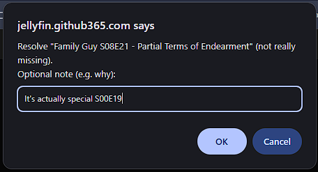

## Diagnose: is it really missing?

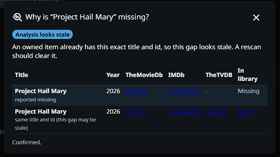

On a movie or show row, **Diagnose** explains why it is reported missing. The popup lays the gap and the
owned items that look like it (matched by title, or already carrying the gap's id) side by side, and leads
with a plain verdict: owned under the wrong id, an owned item already holds this id, the gap looks stale, a
wrong kind of id, or genuinely missing. It corroborates by IMDb and TheTVDB id, so it still catches a title
you own under a localized name, and it weighs both title and year, so a remake that shares a name with
something you own is not mistaken for it. A **Deeper analysis** button confirms against the source provider
and fills in any missing ids.

An **Export for AI analysis** button downloads the diagnosis as a Markdown dossier: the missing item, the
matching rules, the plugin's verdict, the owned candidates it weighed, and an analysis prompt. Hand the
file to any AI to work out why the title was not matched.

The report also runs a library-wide **identification audit**: the same check across your whole library,
downloaded as Markdown grouped by reason, with a link on each finding back into Jellyfin so you can fix the
metadata and rescan.

## Explore a source on demand

The toolbar's **Explore a source** button opens a modal that pulls one source's unowned titles into the
report right now, without a full rescan and without changing your saved settings. Pick a **kind** (studio,
keyword, Discogs label, TMDB list, or MDBList list), choose the source (search and pick a match, or for a
TMDB list paste its ids), then **Run**. The unowned titles merge into the report alongside the scanned
gaps. **Clear explorations** removes everything you added this way; a full rescan also drops any
exploration that is not also saved in your settings.

## Minting several at once

When virtual items are enabled, a select bar lets you checkbox multiple movie rows and **Mint selected**
in one background pass with progress. **Select all** / **Clear** operate on the current filtered view.

## Muting a whole creator or source

On **Creator works** and **Recommendations**, you can dismiss an entire creator or recommendation seed,
not just one row:

- On a creator: **Not interested in creator** stops scanning that person and hides their gaps.
- On a recommendation: the small **x** stops suggestions from that seed title.

To bring one back later, use the **Muted creators:** / **Muted sources:** picker in the saved-views row
(it appears only on those two tabs, and only when something is muted there). Pick the entry and press
**Bring back**; its gaps return on the next scan. This is the way to undo a wholesale dismissal even
after a rescan has dropped its individual rows from the report.

## Tips

- The report reflects the **last scan**. Settings changes need a **Rescan now** to take effect.
- Each pattern tab loads its gaps on demand the first time you open it (and is then cached for the
  session), so a large report does not all transfer at once. The tab counts come from a lightweight
  summary, so they are visible before any tab loads.
- Filmography, recommendation, and TVmaze/TheTVDB series cross-check coverage build up over successive
  scans (stalest-first rotation), so the lists grow run over run rather than all at once. The library's
  own missing-episode reading is not capped and runs every scan.
- Availability never runs during a scan; trigger it from the report when you want "where to watch"
  data, then use the provider filter and **Hide items with no sources**.
