# Using the report

The report is the plugin's "todo list" of what is missing or worth adding. Open it from
**Dashboard > Mind the Gaps** (a left-nav entry under the server dashboard). This page explains the
layout, the domain tabs and pattern views, the toolbar, and the per-row actions. For the settings that feed
it, see the [configuration reference](configuration.md).

## Layout at a glance

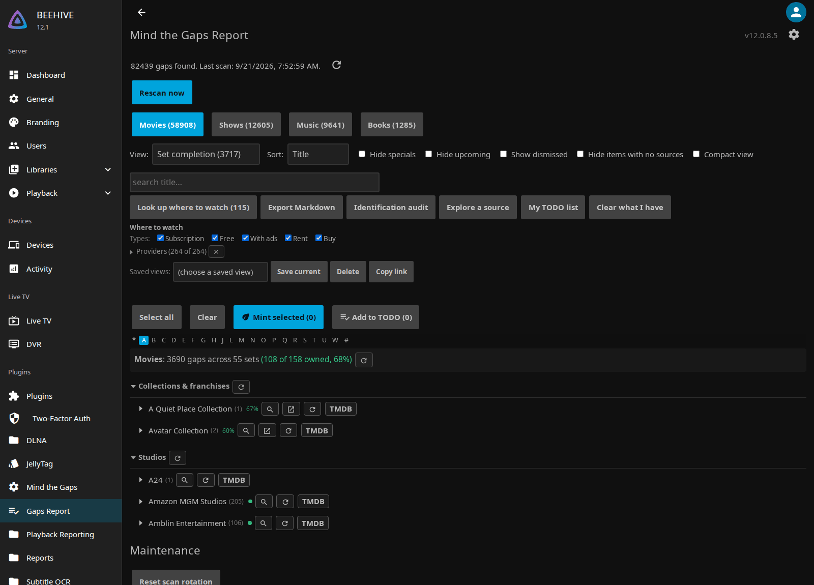

- **Summary line** at the top: how many gaps, when the report was generated, and a reload button that
  re-reads the last saved results without rescanning.
- **Stale banner** (amber): shown when the report was generated by an older plugin version, with a
  **Rescan now** button. The gap ids and links are a stable contract, so a rescan after an upgrade
  keeps your dismissals and enrichment.
- **Rescan now**: runs a full scan in the background and shows progress. A scan can take a while; the
  page polls and reloads when it finishes. Scans also run on a schedule (**Dashboard > Scheduled
  Tasks**).
- **Toolbar**: a filter row (View, Sort, and the checkbox/search filters) and, below it, an action row
  (Look up where to watch, Export, Identification audit, Explore a source, My TODO list, Clear what I have).
- **Domain tabs**: Movies, Shows, Music, Books (below), each badged with its gap count. Only domains with
  gaps show. A **View** dropdown inside the active tab picks the pattern: Set completion, Creator works, or
  Discover.
- **A-Z jump bar** and **rollup**: on the letter-grouped views, for quick navigation.
- **Back to top** button, bottom-right.

A scan runs in the background with live progress:

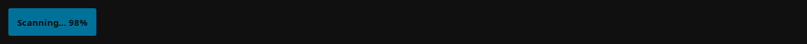

Scans also run on a schedule, alongside a "Refresh where to watch" pass, under **Dashboard > Scheduled Tasks**:

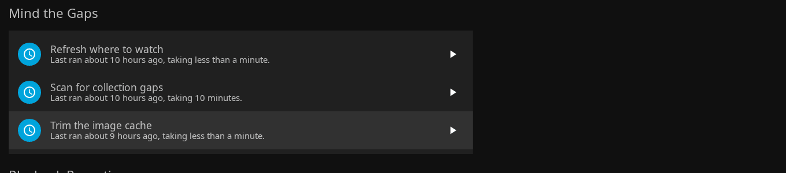

## Domains and patterns (the two axes)

The report is split first by *domain* (**Movies**, **Shows**, **Music**, **Books**), the report's tabs;
only its data is loaded and kept in memory while you view it. Within a domain, the **View** dropdown
picks the *pattern*, the kind of gap: Set completion, Creator works, or Discover. Switching domains
remembers the pattern you last viewed there, so going from Movies > Discover to Shows and back returns you
to Discover, not back to Set completion.

### Set completion

Things that belong to a set you partly own: movies missing from a **collection/franchise**, **seasons
and episodes** missing from a series, and missing entries from **curated studio/keyword sets**. Grouped
by the set (the collection, the series, the studio). This is the "finish what I started" view.

Each row is a concrete missing title with links out (TMDB/IMDb/TheTVDB as applicable) and, for movies,
a **Mint** action if you have enabled virtual items.

The collapsed series and collections lay out in responsive columns, so a large library is not one very
tall list; expanding one widens it to full width in place to show its seasons and episodes. On a
collapsed series, the batch controls appear on hover.

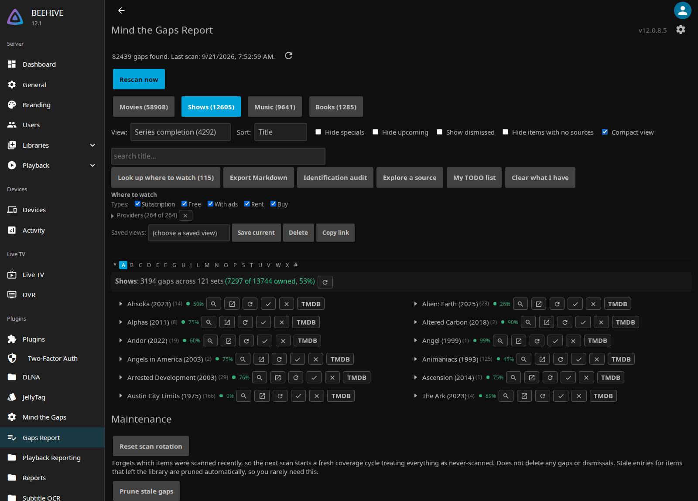

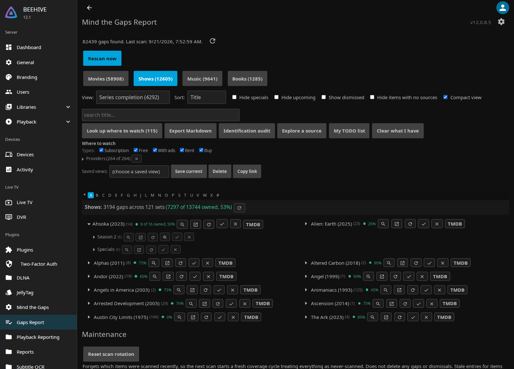

With the **music** source on, an album artist you collect is a Set-completion gap too: their
missing studio albums (a "discography").

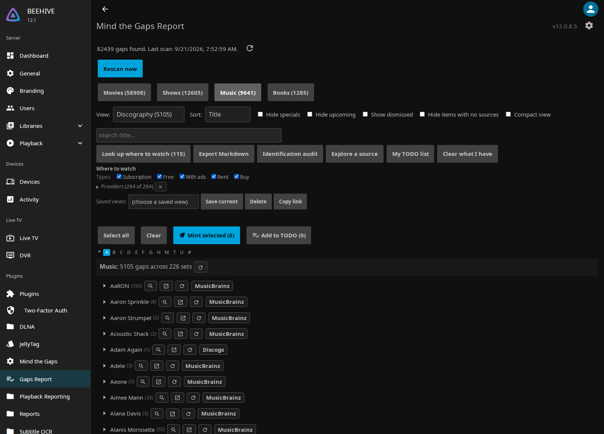

### Creator works

Films and series from an owned person's **filmography** (actor/director/writer) that you do not own.
A film lands on this view under Movies, a series under Shows. Grouped alphabetically by the creator's
initials, then by creator, then the missing titles.

Because filmographies are scanned stalest-first in capped batches, this list **accumulates** over
several scans rather than appearing all at once. A creator you are not collecting can be muted wholesale
(see [Muting a whole creator or source](#muting-a-whole-creator-or-source)).

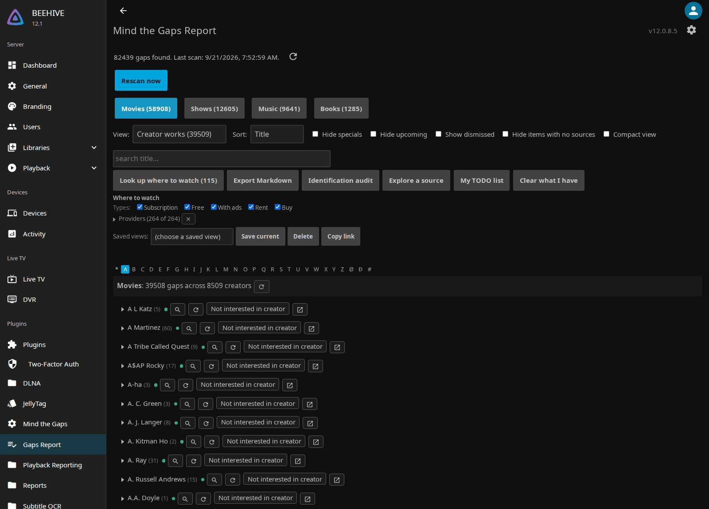

The A-Z bar across the top selects one initial at a time, so even a very large filmography opens quickly.

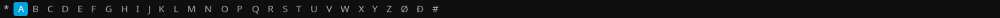

With the **music** source on, a track-only artist's wider catalog ("artist works") appears here too.

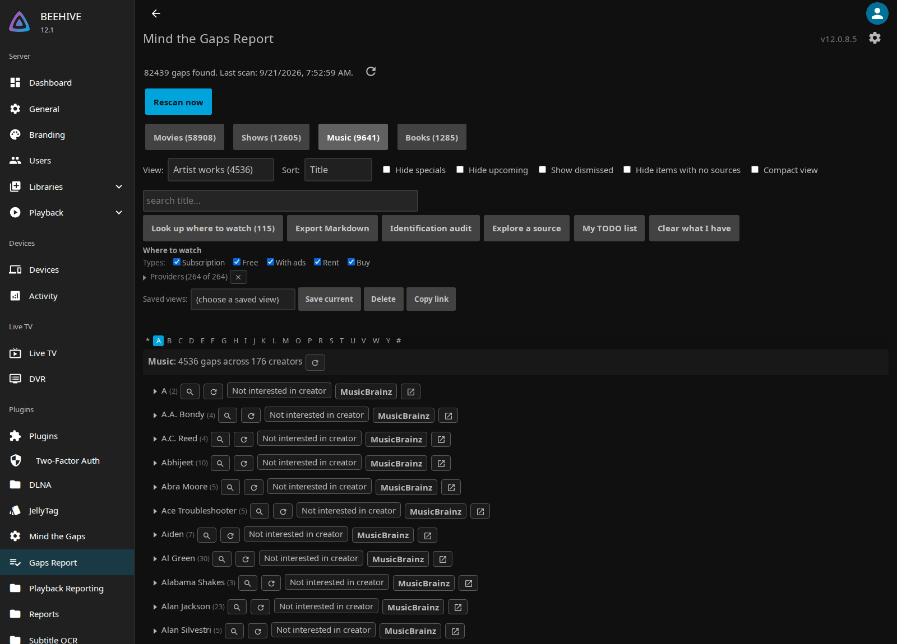

### Discover

TMDB "similar" titles for things you own, that you do not own; TMDB's own Top Rated/Popular/Upcoming/Now
Playing feeds; plus the unowned titles from any list you have added: a TMDB, MDBList, Trakt, or IMDb list,
or your own JustWatch watchlist. This is **discovery**, not completion, so recommendations are off by
default and can be noisy. Grouped alphabetically by the title, with the seed title shown so you know why
something was suggested. A curated list or feed shows as its own group; a title that is both on a list and
recommended groups under the list, with the recommendation kept as a secondary source. A seed you do not
want suggestions from can be muted (the small x on a recommendation, or the picker described below).

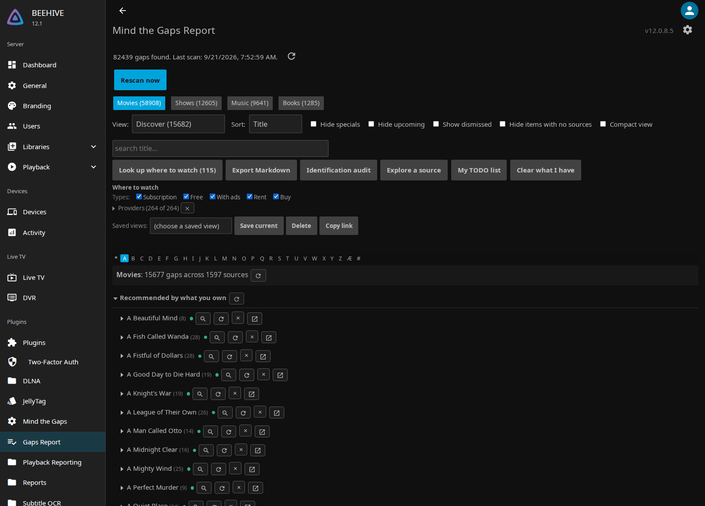

Shows work the same way:

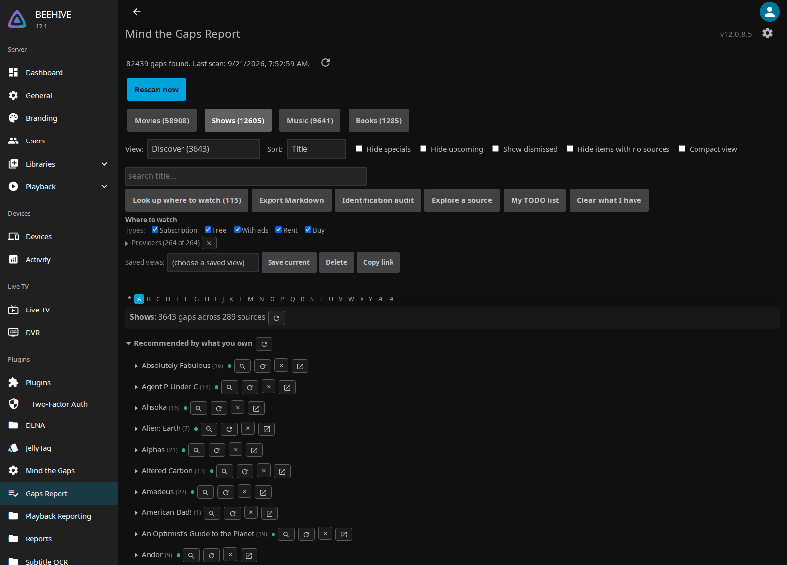

## Toolbar: filters, search, views

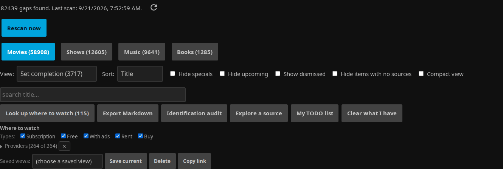

The toolbar has two rows: a filter row (View, Sort, and the checkbox/search filters below) and an action
row (Look up where to watch, Export, Identification audit, Explore a source, My TODO list, Clear what I
have). Both apply to the current domain tab; filters combine (a row must pass all of them).

| Control                        | What it does                                                                                                                                                                                                                                                                                                                                                                                                                                                                                                                                                                                                                         |
| ------------------------------ | ------------------------------------------------------------------------------------------------------------------------------------------------------------------------------------------------------------------------------------------------------------------------------------------------------------------------------------------------------------------------------------------------------------------------------------------------------------------------------------------------------------------------------------------------------------------------------------------------------------------------------------ |
| **View** (pattern)             | Pick the pattern to view within the active domain tab: Set completion, Creator works, or Discover, each badged with its gap count in this domain, listed only when it actually has gaps. The domain tabs above it are the primary selector; this dropdown scopes within whichever one is active. Switching domains remembers the pattern last viewed there.                                                                                                                                                                                                                                                                          |
| **Sort**                       | Reorder rows (for example by title or year).                                                                                                                                                                                                                                                                                                                                                                                                                                                                                                                                                                                         |
| **Compact view**               | Switches every row to a denser layout: a smaller thumbnail, and the same watch links, provider links, and actions collapsed into three icon popovers instead of a longer row (this is the default look for every row; Compact view only shrinks the thumbnail and tightens spacing). Off by default; persisted like the other filters. |
| **Hide specials**              | Drop season-0 / special episodes.                                                                                                                                                                                                                                                                                                                                                                                                                                                                                                                                                                                                    |
| **Hide upcoming**              | Drop gaps that are not out yet, so not yet acquirable: a release date in the future, or, for a movie, series, or episode, no release date at all. TMDB and the episode providers date anything that has actually been released, so an undated title there is announced but unscheduled (a "Bond 26") and is badged **Announced**. Music and books are exempt, since a sparse Discogs, MusicBrainz, or OpenLibrary entry for a decades-old release often carries no date and is a genuine gap. Whether something counts as upcoming is worked out afresh on every scan, so a title stops being upcoming once its release date passes. |
| **Show dismissed**             | Reveal gaps you dismissed; each appears greyed with its status (resolved / not interested / snoozed) and a **Clear** button. Off by default, so dismissed rows stay hidden.                                                                                                                                                                                                                                                                                                                                                                                                                                                          |
| **Hide items with no sources** | Hide gaps with no "where to watch" match for your provider filter. Needs availability data first (see below).                                                                                                                                                                                                                                                                                                                                                                                                                                                                                                                        |
| **Look up where to watch**     | Kicks off the background availability pass: fetches streaming providers for the gaps that do not have them yet, in batches, filling in as it goes. Grouped by watch target, so every episode of a series shares one lookup. The button shows how many titles still need a lookup ("Look up where to watch (N)"), reports live progress while running ("Looking up... 45/320"), and reads "Where to watch: all checked" (disabled) once the backlog is cleared. Requires **Availability** enabled in settings.                                                                                                                        |
| **Provider filter**            | When availability data is present, filter to specific streaming providers.                                                                                                                                                                                                                                                                                                                                                                                                                                                                                                                                                           |
| **Export Markdown**            | Check the rows it is about to write against your library, drop the ones you now hold, then download the current view as filtered as a Markdown file with links. Exporting therefore clears what you already have, and says how many; the file is a list of what you still need rather than a snapshot of what the last scan believed. If the check fails, it exports the list as it stands and tells you so.                                                                                                                                                                                                                          |
| **Search**                     | Free-text filter on the title.                                                                                                                                                                                                                                                                                                                                                                                                                                                                                                                                                                                                       |
| **Saved views**                | Save the current set of filters under a name and re-apply later; **Save current** / **Delete**. Views are stored per browser.                                                                                                                                                                                                                                                                                                                                                                                                                                                                                                        |
| **Copy link**                  | Copy a URL that re-opens this exact view (active domain and pattern plus every filter) when pasted into another browser or shared. Opening such a link applies the view once, then drops the marker from the address bar so a later reload uses your own saved filters. Unlike a saved view, the link is not tied to one browser.                                                                                                                                                                                                                                                                                                                   |
| **My TODO list**               | Open your personal pick-list of gaps to go find, built with the per-row **TODO** button or the multi-select bar. It survives rescans, groups by domain, and each entry has a done tick, links, a **Verify** that checks your library for that one title, and **Delete**. **Verify all** checks every entry at once and ticks what you now hold (and un-ticks anything that has left the library). **Export Markdown** runs that same check first, then downloads the list as a checklist, so the ticks in the file are true as of the download.                                                                                      |
| **Explore a source**           | Open a modal that pulls the unowned titles from one source right now and merges them into the report, without a full rescan and without changing your saved settings. See [Explore a source on demand](#explore-a-source-on-demand).                                                                                                                                                                                                                                                                                                                                                                                                 |
| **Clear what I have**          | The widest scope of the clear-down described under [Per-row actions](#per-row-actions): checks every row currently shown against your library, drops the ones you now hold, then offers a provider re-check for what is left. Confirms the count first.                                                                                                                                                                                                                                                                                                                                                                              |

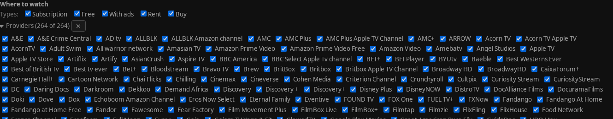

## Per-row actions

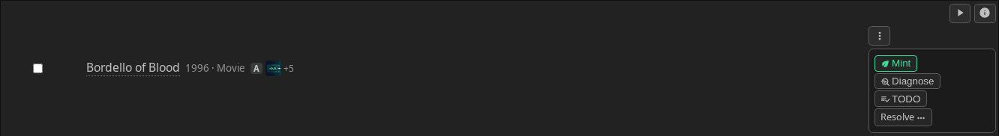

Each gap row carries a title, and hovering or focusing it reveals its overview (and, for a recommendation,
what else recommended it) without leaving the list. Links and actions live behind three icon popovers;
which items appear inside each depends on the gap's kind and your settings.

Once where-to-watch has been looked up, a row also shows up to two small streaming-service icons on its
collapsed line, with a `+N` for the rest (their names are in its tooltip). They follow the provider and
monetization filters, so a service you have switched off never takes one of the two slots, and
subscription, free, and ad-supported services come before rent or buy. A service with no logo yet shows its
initial until the next where-to-watch lookup. The list itself loads a row's overview, links, and offer links
only when you open it, which is what keeps a large tab quick.

- **Watch**: streaming-availability offers, if any have been looked up; otherwise a **Look up where to
  watch** button that fetches them on demand (the toolbar's background pass does many at once). A movie or
  series also gets a **Search JustWatch** link alongside whatever offers are resolved.
- **Info**: the external id links this gap already carries (TMDB/IMDb/TheTVDB/JustWatch and more), plus a
  **search** icon (opens a Jellyfin search for that title, series, collection, or creator in a new tab,
  scoped to the right library type; a creator searches everywhere), an **open in Jellyfin** icon (jumps to
  the item in your library where one exists, for example the owning series of a missing episode), and a
  **clear** icon that clears any dismissal on the row.
- **Actions**: whichever of these apply to the row:
  - **Diagnose** (movie and show rows): explains why the row is reported missing, most often an owned copy
    under the wrong id. See [Diagnose](#diagnose-is-it-really-missing) below.
  - **Radarr** / **Sonarr** / **Request** (when an acquisition target is configured): hands the gap off to
    your downloaders. Radarr sends a missing movie, Sonarr sends the owning series of a missing series or
    episode (it grabs that series' missing episodes), and Request hands either off to Jellyseerr/Overseerr.
    An item appears only for a target you filled in under the
    [Acquisition stack settings](configuration.md#acquisition-stack-optional); the plugin holds the keys
    and makes the call, so they never reach the browser.
  - **Mint** (movies, when virtual items are enabled): creates a tagged, pathless virtual placeholder so
    the gap shows greyed in place. Fully reversible; a later scan drops it once you own the real file. See
    the [README's virtual-placeholders section](../README.md#virtual-placeholders-opt-in).
  - **TODO**: adds the gap to your personal TODO list.
  - **Resolve** (a nested popover; so a gap stops cluttering the list, surviving rescans): **Mark
    resolved** ("not really missing," with an optional note), **Not interested** (a real gap you do not
    want), or, for an upcoming item, **Snooze until release** (hide until the release date). Once
    dismissed, this popover instead shows the dismissal's note and a **Clear** button to undo it (also
    reachable via **Show dismissed**).
- **Batch dismiss a series or season**: on the **Shows** Set completion tree, each series and season group
  header carries **Resolve all** / **Not interested in all**, which dismiss every listed episode under that
  group in one step (after a confirm). They act on the episodes currently shown, so any filter applies.
- **Clear down (the refresh icon)**: one control, on every level and every row, doing the same thing at
  different widths. It first checks everything in scope against your library and drops what you now hold,
  which is local, instant, and contacts no provider. Confirming a title clears it from **every** view it
  appeared on, not just the one you are looking at: acquiring Mad Max 2 drops it from the Mad Max collection,
  from the studio set that wanted it, from its director's filmography, and from any recommendation or list
  that suggested it, in one go. If anything is still missing and its source can be
  re-run for one item, it then offers to ask the providers again, which also picks up whatever has been
  added since the last scan. That second step is always a prompt, so the everyday case (I filled these,
  clear them) stays one click and never spends a provider call.

  The scopes, widest first:

  | Where                                                                                                                | Covers                          |
  | -------------------------------------------------------------------------------------------------------------------- | ------------------------------- |
  | The rollup line ("Shows: 679 gaps across 17 sets")                                                                   | every row shown for that domain |
  | A Set completion kind heading (Collections and franchises, Studios, Keywords, Discography, Record labels)            | every row under that kind       |
  | Any group header (a collection, studio, keyword, series, artist, author, creator, curated list, recommendation seed) | every row listed under it       |
  | A season header                                                                                                      | that season's episodes          |
  | Any row                                                                                                              | that one title                  |
  | **Clear what I have** in the toolbar                                                                                 | the whole filtered view          |

  Kind headings only render when a domain's Set completion holds more than one kind, so **Shows** has none;
  its rollup line is the level above the series groups. **Creator works** and **Discover** group straight by
  source and have no kind level at all, so the same applies there.

  The re-check half is offered only for sources the server can re-run per item: a movie collection, a music
  artist, a book author, and a series. A studio, keyword, Discogs label, or curated list is keyed to a
  synthetic id rather than a library item, and a film filmography or recommendation seed would need a
  library-wide ownership pass, so those get the library check alone. A re-check covering more than one
  source runs in the background with progress and saves each one as it finishes.

Resolving a gap can carry an optional note (for example why it is not really missing):

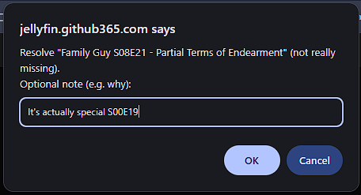

## Diagnose: is it really missing?

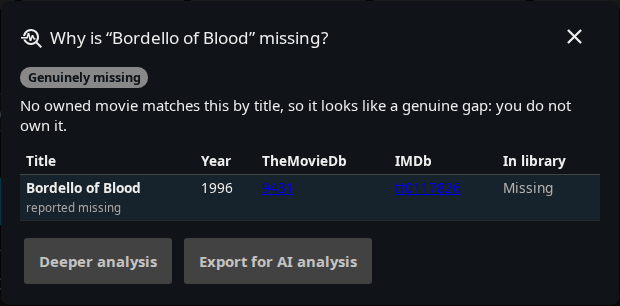

On a movie or show row, **Diagnose** explains why it is reported missing. The popup lays the gap and the
owned items that look like it (matched by title, or already carrying the gap's id) side by side, and leads
with a plain verdict: owned under the wrong id, an owned item already holds this id, the gap looks stale, a
wrong kind of id, or genuinely missing. It corroborates by IMDb and TheTVDB id, so it still catches a title
you own under a localized name, and it weighs both title and year, so a remake that shares a name with
something you own is not mistaken for it. A **Deeper analysis** button confirms against the source provider
and fills in any missing ids.

An **Export for AI analysis** button downloads the diagnosis as a Markdown dossier: the missing item, the
matching rules, the plugin's verdict, the owned candidates it weighed, and an analysis prompt. Hand the
file to any AI to work out why the title was not matched.

The report also runs an **identification audit**: the same check across the domain and pattern you are
viewing (so an audit from Shows lists shows, not movies), downloaded as Markdown grouped by reason, with a
link on each finding back into Jellyfin so you can fix the metadata and rescan.

## Explore a source on demand

The toolbar's **Explore a source** button opens a modal that pulls one source's unowned titles into the
report right now, without a full rescan and without changing your saved settings. Pick a **kind** (studio,
keyword, Discogs label, TMDB list, or MDBList list), choose the source (search and pick a match, or for a
TMDB list paste its ids), then **Run**. The unowned titles merge into the report alongside the scanned
gaps. **Clear explorations** removes everything you added this way; a full rescan also drops any
exploration that is not also saved in your settings.

## Minting several at once

When virtual items are enabled, a select bar lets you checkbox multiple movie rows and **Mint selected**
in one background pass with progress. **Select all** / **Clear** operate on the current filtered view.

## Muting a whole creator or source

On **Creator works** and **Recommendations**, you can dismiss an entire creator or recommendation seed,
not just one row:

- On a creator: **Not interested in creator** stops scanning that person and hides their gaps.
- On a recommendation: the small **x** stops suggestions from that seed title.

To bring one back later, use the **Muted creators:** / **Muted sources:** picker in the saved-views row
(it appears only on those two views, and only when something is muted there). Pick the entry and press
**Bring back**; its gaps return on the next scan. This is the way to undo a wholesale dismissal even
after a rescan has dropped its individual rows from the report.

## Tips

- The report reflects the **last scan**. Settings changes need a **Rescan now** to take effect.
- Each domain+pattern combination loads its gaps on demand the first time you view it, and only the
  active domain's data stays cached; switching to another domain drops what is no longer shown, so a
  large report does not all sit in memory at once. The tab and View badges come from a lightweight
  summary, so counts are visible before any of them load.
- Filmography, recommendation, and TVmaze/TheTVDB series cross-check coverage build up over successive
  scans (stalest-first rotation), so the lists grow run over run rather than all at once. The library's
  own missing-episode reading is not capped and runs every scan.
- Availability never runs during a scan; trigger it from the report when you want "where to watch"
  data, then use the provider filter and **Hide items with no sources**.
